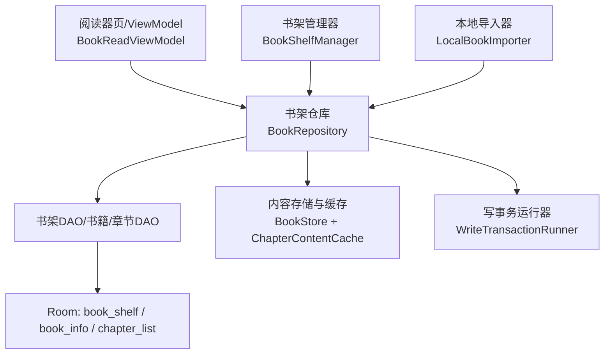
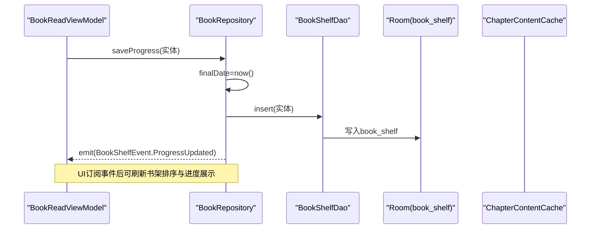
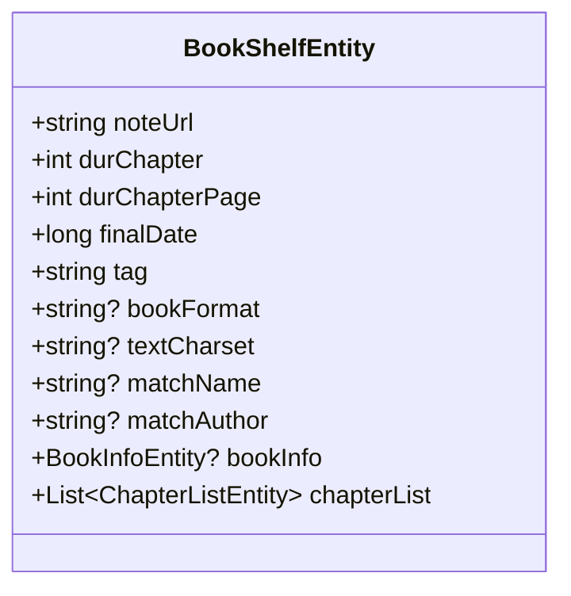
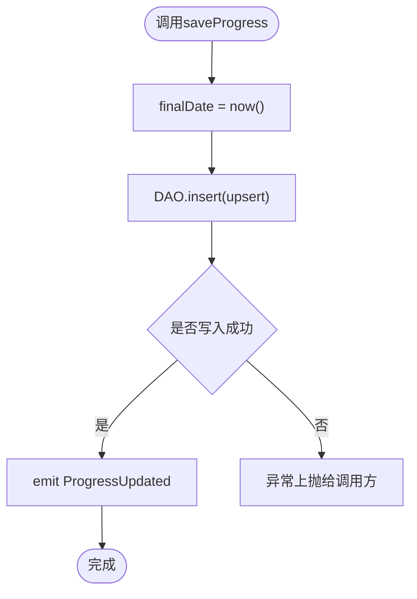
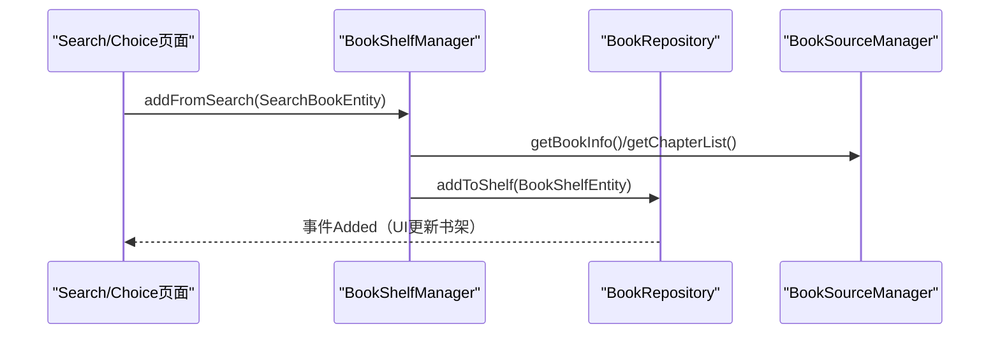
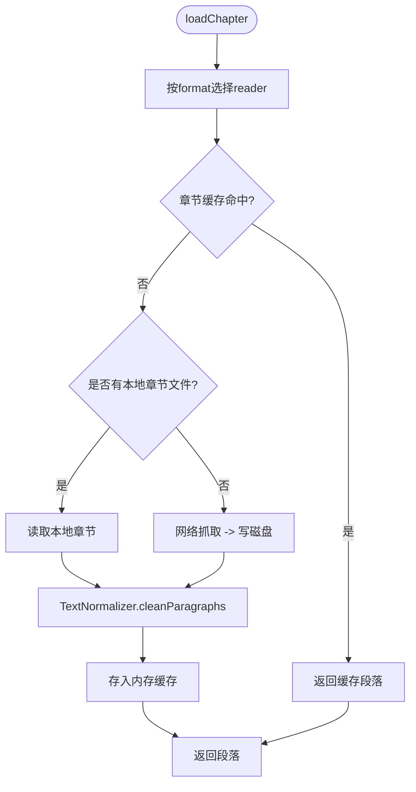
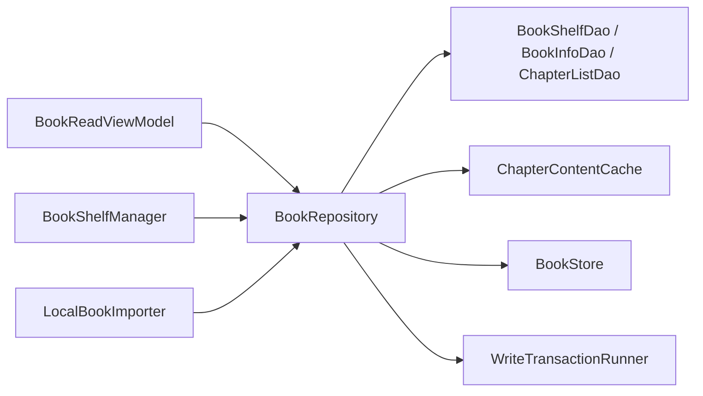

# 阅读进度同步

<cite>
**本文引用的文件列表**
- [BookRepository.kt](file://lib_book_common/src/main/java/com/ebook/common/repository/BookRepository.kt)
- [BookShelfManager.kt](file://lib_book_common/src/main/java/com/ebook/common/manager/BookShelfManager.kt)
- [BookShelfEntity.kt](file://lib_ebook_db/src/main/java/com/ebook/db/entity/BookShelfEntity.kt)
- [BookShelfDao.kt](file://lib_ebook_db/src/main/java/com/ebook/db/dao/BookShelfDao.kt)
- [TransactionModule.kt](file://lib_book_common/src/main/java/com/ebook/common/di/TransactionModule.kt)
- [ContentStoreModule.kt](file://lib_book_common/src/main/java/com/ebook/common/di/ContentStoreModule.kt)
- [LocalBookImporter.kt](file://lib_book_common/src/main/java/com/ebook/common/importer/LocalBookImporter.kt)
- [BookReadViewModel.kt](file://module_book/src/main/java/com/ebook/book/mvvm/viewmodel/BookReadViewModel.kt)
</cite>

## 目录
1. 简介
2. 项目结构
3. 核心组件
4. 架构总览
5. 详细组件分析
6. 依赖关系分析
7. 性能考量
8. 故障排查指南
9. 结论

## 简介
本技术文档围绕“阅读进度同步”展开，聚焦阅读状态的持久化与跨模块共享、离线模式下的本地存储策略、以及多设备同步的数据一致性设计。内容覆盖数据结构设计、仓库读写能力、管理器状态协调、事务与一致性保障，并给出迁移策略与优化建议。

## 项目结构
阅读进度的关键实现集中在 lib_book_common（书架仓库、章节读取与缓存）、lib_ebook_db（Room 实体与 DAO），以及 module_book（阅读器 ViewModel）。整体遵循 MVVM：UI → ViewModel → Repository → DAO → Room；同时通过 Flow 在 UI 层响应式刷新。



图表来源
- [BookRepository.kt:31-200](file://lib_book_common/src/main/java/com/ebook/common/repository/BookRepository.kt#L31-L200)
- [BookShelfDao.kt:8-109](file://lib_ebook_db/src/main/java/com/ebook/db/dao/BookShelfDao.kt#L8-L109)
- [BookReadViewModel.kt:21-123](file://module_book/src/main/java/com/ebook/book/mvvm/viewmodel/BookReadViewModel.kt#L21-L123)
- [TransactionModule.kt:13-24](file://lib_book_common/src/main/java/com/ebook/common/di/TransactionModule.kt#L13-L24)
- [LocalBookImporter.kt:34-144](file://lib_book_common/src/main/java/com/ebook/common/importer/LocalBookImporter.kt#L34-L144)

节来源
- [BookRepository.kt:31-200](file://lib_book_common/src/main/java/com/ebook/common/repository/BookRepository.kt#L31-L200)
- [BookShelfDao.kt:8-109](file://lib_ebook_db/src/main/java/com/ebook/db/dao/BookShelfDao.kt#L8-L109)

## 核心组件
- BookShelfEntity：书架条目实体，承载主键（note_url）、当前进度（durChapter、durChapterPage）、最后阅读时间（finalDate）等字段。
- BookRepository：书架数据操作中心，提供进度更新、加入书架/移除、章节统一读取、事件发布等。
- BookShelfManager：封装加入书架的完整流程（查询书架、标记在架、从搜索结果添加），向上暴露易用 API。
- BookReadViewModel：阅读器 ViewModel，负责捕获用户阅读行为、更新本地内存中的 BookShelfEntity 字段并调用 Repository 持久化。
- TransactionModule：基于 Room 3 写事务的统一封装，确保多表写入原子性。
- LocalBookImporter：本地书导入流水线，包含拷贝即哈希、切章落盘、批量事务写入及入库事件推送。
- ContentStoreModule：装配章节正文读写器与缓存，支持 TXT/EPUB/网络书源统一读取路径。

节来源
- [BookShelfEntity.kt:14-76](file://lib_ebook_db/src/main/java/com/ebook/db/entity/BookShelfEntity.kt#L14-L76)
- [BookRepository.kt:31-200](file://lib_book_common/src/main/java/com/ebook/common/repository/BookRepository.kt#L31-L200)
- [BookShelfManager.kt:11-62](file://lib_book_common/src/main/java/com/ebook/common/manager/BookShelfManager.kt#L11-L62)
- [BookReadViewModel.kt:21-123](file://module_book/src/main/java/com/ebook/book/mvvm/viewmodel/BookReadViewModel.kt#L21-L123)
- [TransactionModule.kt:13-24](file://lib_book_common/src/main/java/com/ebook/common/di/TransactionModule.kt#L13-L24)
- [LocalBookImporter.kt:34-144](file://lib_book_common/src/main/java/com/ebook/common/importer/LocalBookImporter.kt#L34-L144)
- [ContentStoreModule.kt:21-87](file://lib_book_common/src/main/java/com/ebook/common/di/ContentStoreModule.kt#L21-L87)

## 架构总览
书架进程侧使用 Room 单库作为“权威源”，并通过 Flow 提供响应式观察；仓库层将 CRUD、进度保存、章节读取、事件分发集中管理。事件总线以 SharedFlow 形式发布，各 UI 订阅后刷新。



图表来源
- [BookRepository.kt:111-116](file://lib_book_common/src/main/java/com/ebook/common/repository/BookRepository.kt#L111-L116)
- [BookShelfDao.kt:70-79](file://lib_ebook_db/src/main/java/com/ebook/db/dao/BookShelfDao.kt#L70-L79)

节来源
- [BookRepository.kt:111-116](file://lib_book_common/src/main/java/com/ebook/common/repository/BookRepository.kt#L111-L116)
- [BookShelfDao.kt:70-79](file://lib_ebook_db/src/main/java/com/ebook/db/dao/BookShelfDao.kt#L70-L79)

## 详细组件分析

### 阅读进度数据结构与设计
- 主键 noteUrl：标识一本书的笔记地址，用于唯一识别同一本书在不同来源下的条目。
- durChapter/durChapterPage：记录当前阅读到的章节目录索引与页码。
- finalDate：最后阅读时间戳，用于“最近阅读优先”的排序。
- tag/bookFormat/textCharset/matchName/matchAuthor：辅助字段，分别用于归属标记、解析格式路由、字符集缓存以及评论合并的关键匹配名/作者。
- bookInfo/chapterList：@Ignore 的非持久化关联字段，由查询时装配或调用方填充。

类型映射要点
- durChapter/durChapterPage：整型，对应 Room 列 dur_chapter/dur_chapter_page。
- finalDate：长整型，对应 final_date。
- tag/bookFormat/textCharset/matchName/matchAuthor：字符串，必要时可空。
- 书签管理：目前未引入独立“书签”表，书签可通过“章节级定位”复用 chapterList 与进度字段完成轻量标记（若扩展需新增字段/表并在 DAO 层提供 upsert）。

节来源
- [BookShelfEntity.kt:14-76](file://lib_ebook_db/src/main/java/com/ebook/db/entity/BookShelfEntity.kt#L14-L76)
- [BookShelfDao.kt:8-109](file://lib_ebook_db/src/main/java/com/ebook/db/dao/BookShelfDao.kt#L8-L109)



图表来源
- [BookShelfEntity.kt:14-76](file://lib_ebook_db/src/main/java/com/ebook/db/entity/BookShelfEntity.kt#L14-L76)

### BookRepository 读写操作（进度更新、书签管理、CRUD）
- 进度更新：saveProgress 将 finalDate 设置为当前时间，通过 DAO 执行 REPLACE upsert，并以事件通知变更。
- 添加到书架：addToShelf 会依次写入 book_info（可选）、book_shelf、chapter_list（如有）、book_group（评论聚合用），最后触发 Added 事件。
- 移除书架：removeFromShelf 清理 chapter_list、book_info、book_group、book_shelf，并通过 BookStore 删除章文件、清除内容缓存，触发 Removed 事件。
- 章节正文统一读取：loadChapter 根据 bookFormat 选择 ChapterReader，进行段落规范化后通过内存缓存返回，屏蔽本地书与网络书的差异。
- 事件机制：通过 SharedFlow<BookShelfEvent> 发布 Added/Removed/ProgressUpdated，供 UI 订阅响应。



图表来源
- [BookRepository.kt:111-116](file://lib_book_common/src/main/java/com/ebook/common/repository/BookRepository.kt#L111-L116)

节来源
- [BookRepository.kt:111-162](file://lib_book_common/src/main/java/com/ebook/common/repository/BookRepository.kt#L111-L162)
- [BookRepository.kt:180-200](file://lib_book_common/src/main/java/com/ebook/common/repository/BookRepository.kt#L180-L200)

### BookShelfManager 状态管理与跨模块共享
- 加载书架列表：为搜索结果提供“已在架”标记依据。
- 结果去重与标记：比较搜索结果与书架 URL 集合，为在架项置位标记。
- 从搜索加入：组装基础书架实体，拉取元数据与目录，调用 Repository 添加，封装异常与取消传播。



图表来源
- [BookShelfManager.kt:11-62](file://lib_book_common/src/main/java/com/ebook/common/manager/BookShelfManager.kt#L11-L62)
- [BookRepository.kt:118-148](file://lib_book_common/src/main/java/com/ebook/common/repository/BookRepository.kt#L118-L148)

节来源
- [BookShelfManager.kt:11-62](file://lib_book_common/src/main/java/com/ebook/common/manager/BookShelfManager.kt#L11-L62)

### 离线模式的进度保存与本地存储策略
- 进度保存强依赖本地 Room，无需网络即可持久化 finalDate/durChapter/durChapterPage。
- 章节正文读路径在 loadChapter 中：若本地已有章节文件则直接读取，否则走网络抓取并落盘；全部经内存缓存加速二次访问。
- 导入期通过“先改名目录，再写数据库”的顺序保证不留下悬空引用；失败回滚时同步删除已落盘的章文件。



图表来源
- [BookRepository.kt:180-200](file://lib_book_common/src/main/java/com/ebook/common/repository/BookRepository.kt#L180-L200)
- [LocalBookImporter.kt:62-144](file://lib_book_common/src/main/java/com/ebook/common/importer/LocalBookImporter.kt#L62-L144)

节来源
- [BookRepository.kt:180-200](file://lib_book_common/src/main/java/com/ebook/common/repository/BookRepository.kt#L180-L200)
- [LocalBookImporter.kt:62-144](file://lib_book_common/src/main/java/com/ebook/common/importer/LocalBookImporter.kt#L62-L144)

### 多设备同步的设计考虑与冲突解决（方案建议）
当前代码侧重本地一致性。面向多端一致性的建议方案（可作为后续演进）：
- 服务器端维护每个 noteUrl 对应的最新版本号（或服务端时间戳）以及进度字段。
- 客户端每次上报时携带乐观锁版本号/最后修改时间，服务器进行 compare-and-swap 或 time-wins 裁决。
- 冲突检测：当客户端检测到服务端的最终时间与本地不同，触发合并流程，通常以“最近修改优先”为原则，或提示用户手动选择保留版本。
- 增量同步：仅同步变化过的进度字段与书签变动，减少带宽与功耗。
- 断线续传：本地队列记录未同步的变更记录（如 ProgressUpdated 事件），联网后重试直到确认成功。

注：以上为跨设备一致性的通用策略指导，当前仓库尚未包含服务端集成代码，实际实现应以未来接口契约为准。

[本节为概念说明，无直接源码映射]

### 事务处理与一致性保障
- WriteTransactionRunner：基于 Room 3 的事务封装，对 import 等多步写入进行原子提交，任何一步失败均整体回滚。
- 导入流程中的多表写入（shelf/info/chapter/group）被包裹在一个事务内，且与“先改目录、再写库、失败清理”的文件操作协同，避免脏数据残留。

```mermaid
sequenceDiagram
    participant Imp as "LocalBookImporter"
    participant Tx as "WriteTransactionRunner"
    participant Dao as "Multiple DAOs"
    Imp->>Tx: run {
        Imp->>Dao: insert shelf
        Imp->>Dao: insert info
        Imp->>Dao: insertAll chapters
        Imp->>Dao: insert group
    }
    Note over Tx: 任一抛出异常 → 整体回滚
    Tx-->>Imp: 提交成功
```

图表来源
- [TransactionModule.kt:13-24](file://lib_book_common/src/main/java/com/ebook/common/di/TransactionModule.kt#L13-L24)
- [LocalBookImporter.kt:120-135](file://lib_book_common/src/main/java/com/ebook/common/importer/LocalBookImporter.kt#L120-L135)

节来源
- [TransactionModule.kt:13-24](file://lib_book_common/src/main/java/com/ebook/common/di/TransactionModule.kt#L13-L24)
- [LocalBookImporter.kt:120-135](file://lib_book_common/src/main/java/com/ebook/common/importer/LocalBookImporter.kt#L120-L135)

### 进度迁移与兼容性
- 通过 Room @ColumnInfo(name="...") 控制列名，实体字段调整时需维护迁移链（升级 version、追加 MIGRATION_n_n+1 并生成 schema JSON），禁止开启破坏性降级。
- 对于既有历史数据，建议增加兼容逻辑：如新增字段有默认值；复杂转换应在迁移中处理，或在首次启动时补全缺失字段。

节来源
- [BookShelfEntity.kt:14-76](file://lib_ebook_db/src/main/java/com/ebook/db/entity/BookShelfEntity.kt#L14-L76)

## 依赖关系分析
- 依赖方向：业务模块 → lib_book_common → lib_ebook_api → lib_ebook_db（DB为基础，无循环）。
- Repository 注入依赖包括 DAO、ChapterReader 工厂 Map、内容缓存、事务运行器。
- Manager 依赖 Repository，隔离重复业务流程。
- ViewModel 仅持有一处 BookRepository 引用，保持单一职责。



图表来源
- [BookRepository.kt:41-53](file://lib_book_common/src/main/java/com/ebook/common/repository/BookRepository.kt#L41-L53)
- [ContentStoreModule.kt:21-87](file://lib_book_common/src/main/java/com/ebook/common/di/ContentStoreModule.kt#L21-L87)

节来源
- [BookRepository.kt:41-53](file://lib_book_common/src/main/java/com/ebook/common/repository/BookRepository.kt#L41-L53)
- [ContentStoreModule.kt:21-87](file://lib_book_common/src/main/java/com/ebook/common/di/ContentStoreModule.kt#L21-L87)

## 性能考量
- 响应式列表：observeBookShelf 基于 Flow，Room 自动失效触发，避免重复查询。
- 显式排序：获取详情时对章节按序号排序，修正历史行 rowid 导致的乱序，提升渲染稳定性。
- 内存缓存：章节内容经 ChapterContentCache 缓存，避免重复解析与 IO。
- 批量写入：导入过程在事务中一次性写入多表，减少提交开销。
- 流式处理：导入章节写盘采用流式回调，逐章推进 UI 进度，避免一次性大对象造成卡顿。

[本节为一般性能讨论，结合源码体现的策略在上文已标注出处]

## 故障排查指南
- 进度未更新
  - 检查 ViewModel 是否正确调用 updateProgress/saveProgress；查看 Repository 是否 emit ProgressUpdated。
- 列表错序或章节错位
  - 确认使用了带排序的细节查询；留意 REPLACE/插入顺序是否扰动 rowid。
- 本地书导入失败
  - 关注事务失败回滚与临时目录清理；确认章节切分出非空，否则会中断并删除已落盘内容。
- 无法读取章节
  - 核查 contentRef 与格式路由（TXT/EPUB/NETWORK）是否匹配；确认缓存是否命中。
- 网络断开时的体验
  - 进度保存依赖本地 Room，不会崩溃；若正文不可用则返回空或错误态，页面应展示合适提示。

节来源
- [BookRepository.kt:111-162](file://lib_book_common/src/main/java/com/ebook/common/repository/BookRepository.kt#L111-L162)
- [BookReadViewModel.kt:33-46](file://module_book/src/main/java/com/ebook/book/mvvm/viewmodel/BookReadViewModel.kt#L33-L46)
- [LocalBookImporter.kt:62-144](file://lib_book_common/src/main/java/com/ebook/common/importer/LocalBookImporter.kt#L62-L144)

## 结论
本项目的阅读进度体系以 Room 为权威源，通过 BookRepository 统一管理进度持久化、事件发布与章节统一读取；以 SharedFlow 实现跨模块的状态共享，配合 Flow 观察提供响应式 UI 刷新。导入与多表写入通过事务保障一致性；离线场景下具备完善的本地落盘与缓存策略。面向未来的多设备同步可扩展乐观锁/时间戳冲突解决与增量上报，进一步提升用户体验与资源效率。