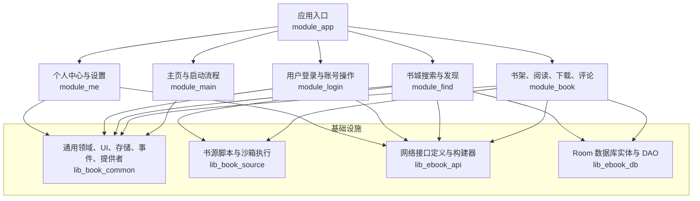
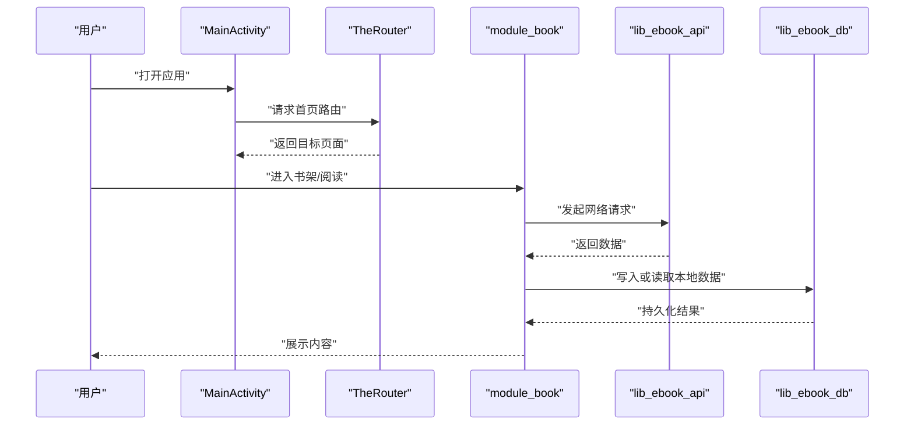
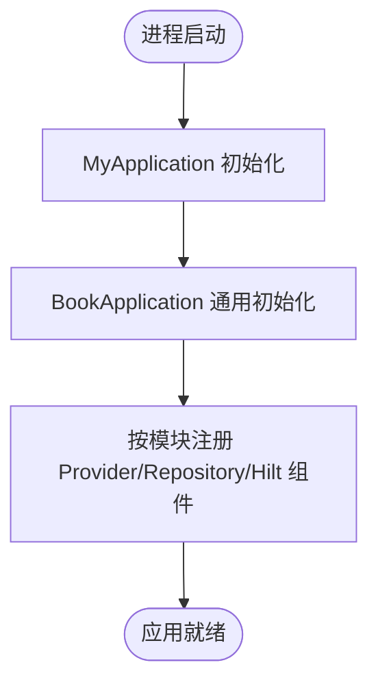
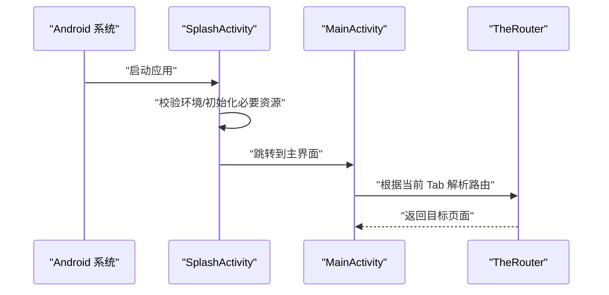
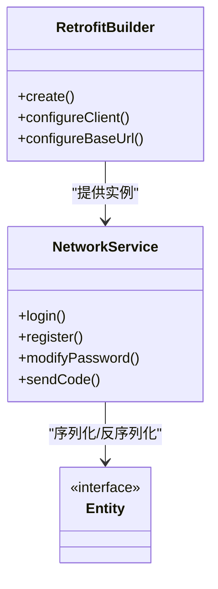
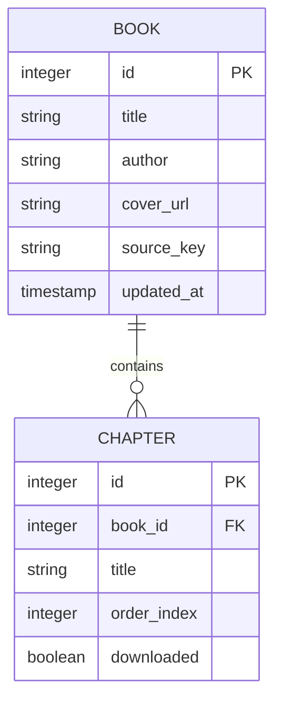
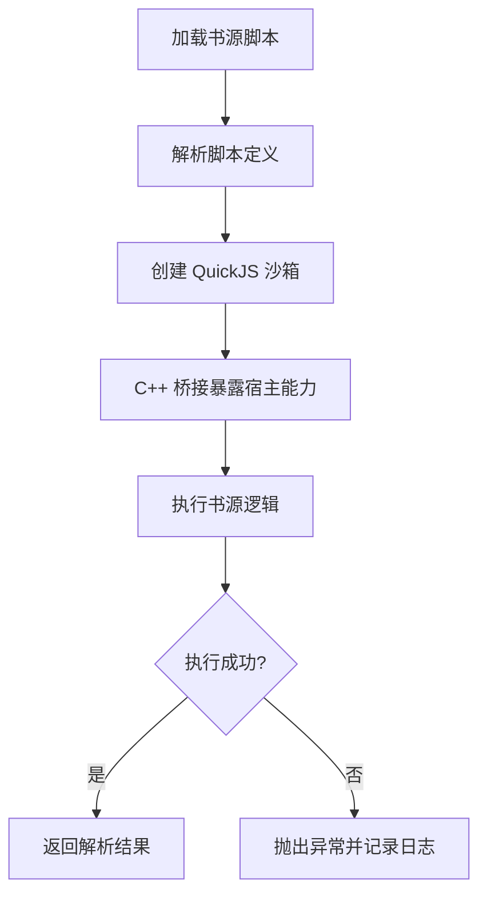
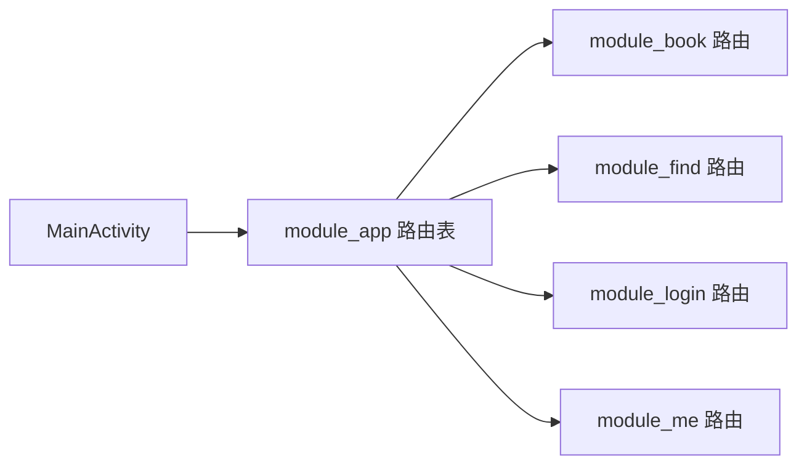
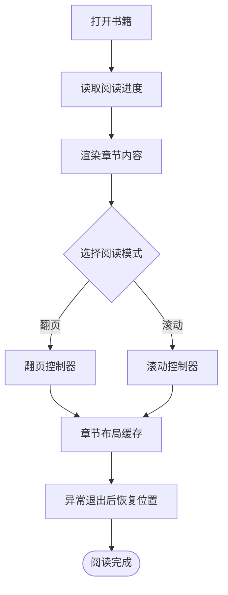
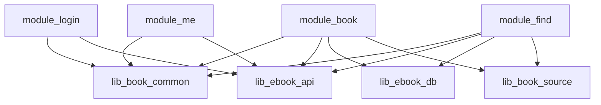

# 项目概览

<cite>
**本文引用的文件**
- [README.MD](file://README.MD)
- [settings.gradle.kts](file://settings.gradle.kts)
- [build.gradle.kts](file://build.gradle.kts)
- [gradle.properties](file://gradle.properties)
- [compose_compiler_config.conf](file://compose_compiler_config.conf)
- [module_app/src/main/java/com/ebook/MyApplication.kt](file://module_app/src/main/java/com/ebook/MyApplication.kt)
- [module_main/src/main/java/com/ebook/main/MainActivity.kt](file://module_main/src/main/java/com/ebook/main/MainActivity.kt)
- [module_main/src/main/java/com/ebook/main/SplashActivity.kt](file://module_main/src/main/java/com/ebook/main/SplashActivity.kt)
- [lib_book_common/src/main/java/com/ebook/common/BookApplication.kt](file://lib_book_common/src/main/java/com/ebook/common/BookApplication.kt)
- [lib_ebook_api/src/main/java/com/ebook/api/RetrofitBuilder.kt](file://lib_ebook_api/src/main/java/com/ebook/api/RetrofitBuilder.kt)
- [lib_ebook_db/src/main/java/com/ebook/db/AppDatabase.kt](file://lib_ebook_db/src/main/java/com/ebook/db/AppDatabase.kt)
- [lib_book_source/src/main/java/com/ebook/source/sandbox/SandboxConnection.kt](file://lib_book_source/src/main/java/com/ebook/source/sandbox/SandboxConnection.kt)
- [module_app/src/main/assets/therouter/routeMap.json](file://module_app/src/main/assets/therouter/routeMap.json)
- [module_book/src/main/assets/therouter/routeMap.json](file://module_book/src/main/assets/therouter/routeMap.json)
- [module_find/src/main/assets/therouter/routeMap.json](file://module_find/src/main/assets/therouter/routeMap.json)
- [module_login/src/main/assets/therouter/routeMap.json](file://module_login/src/main/assets/therouter/routeMap.json)
- [module_me/src/main/assets/therouter/routeMap.json](file://module_me/src/main/assets/therouter/routeMap.json)
- [docs/adr/0028-untrusted-js-sandbox.md](file://docs/adr/0028-untrusted-js-sandbox.md)
</cite>

## 目录
1. [简介](#简介)
2. [项目结构](#项目结构)
3. [核心组件](#核心组件)
4. [架构总览](#架构总览)
5. [详细组件分析](#详细组件分析)
6. [依赖分析](#依赖分析)
7. [性能与可维护性考量](#性能与可维护性考量)
8. [快速开始指南](#快速开始指南)
9. [故障排查](#故障排查)
10. [结论](#结论)

## 简介
本项目是一个面向 Android 平台的小说阅读器，围绕“书架管理、书城搜索、阅读体验、用户认证、评论系统、下载管理”等核心能力构建。工程采用多模块组织：业务模块负责页面、交互与领域逻辑，基础设施模块提供网络、数据库、通用领域模型、UI 与工具能力；同时通过 TheRouter 实现弱耦合的页面路由，通过 QuickJS 沙箱执行不受信任的书源脚本，从而兼顾扩展性与安全性。

从技术栈看，项目以 Kotlin 为主语言，界面层使用 Jetpack Compose，状态管理与依赖注入采用 MVVM + Hilt，网络层基于 Retrofit，本地持久化采用 Room，并配合 Gradle build-logic 与版本目录统一管理构建配置。

## 项目结构
仓库采用 Gradle 多模块工程。顶层 `settings.gradle.kts` 声明了所有模块，根 `build.gradle.kts` 集中管理插件与公共依赖，`gradle.properties` 配置全局 Gradle 行为，`compose_compiler_config.conf` 配置 Compose 编译器选项。

图表来源
- [settings.gradle.kts](file://settings.gradle.kts)
- [build.gradle.kts](file://build.gradle.kts)
- [module_app/src/main/java/com/ebook/MyApplication.kt](file://module_app/src/main/java/com/ebook/MyApplication.kt)
- [module_main/src/main/java/com/ebook/main/MainActivity.kt](file://module_main/src/main/java/com/ebook/main/MainActivity.kt)
- [module_book/src/main/java/com/ebook/book/ReadBookActivity.kt](file://module_book/src/main/java/com/ebook/book/ReadBookActivity.kt)
- [module_find/src/main/java/com/ebook/find/SearchActivity.kt](file://module_find/src/main/java/com/ebook/find/SearchActivity.kt)
- [module_login/src/main/java/com/ebook/login/LoginActivity.kt](file://module_login/src/main/java/com/ebook/login/LoginActivity.kt)
- [lib_book_common/src/main/java/com/ebook/common/BookApplication.kt](file://lib_book_common/src/main/java/com/ebook/common/BookApplication.kt)
- [lib_ebook_api/src/main/java/com/ebook/api/RetrofitBuilder.kt](file://lib_ebook_api/src/main/java/com/ebook/api/RetrofitBuilder.kt)
- [lib_ebook_db/src/main/java/com/ebook/db/AppDatabase.kt](file://lib_ebook_db/src/main/java/com/ebook/db/AppDatabase.kt)

章节来源
- [settings.gradle.kts](file://settings.gradle.kts)
- [build.gradle.kts](file://build.gradle.kts)
- [gradle.properties](file://gradle.properties)
- [compose_compiler_config.conf](file://compose_compiler_config.conf)

## 核心组件
- 应用与初始化
  - 应用进程入口在 module_app，负责初始化全局上下文与第三方库；lib_book_common 中的 BookApplication 暴露通用初始化点，便于各模块复用。
- 主页与导航
  - module_main 提供 SplashActivity 与 MainActivity，作为主入口和底部导航容器；通过 TheRouter 跳转到功能页。
- 书架与阅读
  - module_book 聚合书架、详情、阅读、下载管理、评论、编辑元数据等页面；Reader 相关逻辑集中在 reader 包，包含翻页、滚动、缓存、进度恢复等。
- 书城搜索
  - module_find 提供书库列表、搜索结果合并、详情页跳转；底层通过 lib_book_source 加载书源脚本进行检索。
- 用户认证
  - module_login 提供登录、注册、密码修改、验证等页面；依赖 lib_ebook_api 的用户认证接口。
- 个人中心
  - module_me 提供设置、缓存管理、更新检查、书源管理等；与 lib_book_common 的 Store、Repository、Domain 层协作。
- 基础设施
  - lib_book_common：领域模型、事件总线、Store（偏好/本地存储）、Provider（内容/图片等）、UI 组件、工具方法、Hilt 注入配置。
  - lib_book_source：书源脚本解析与执行、QuickJS 沙箱桥接、C++ 桥接、测试资源。
  - lib_ebook_api：Retrofit 构建器、网络拦截器、API 服务与实体类。
  - lib_ebook_db：Room 数据库、Entity、DAO、迁移与事件。

章节来源
- [module_app/src/main/java/com/ebook/MyApplication.kt](file://module_app/src/main/java/com/ebook/MyApplication.kt)
- [lib_book_common/src/main/java/com/ebook/common/BookApplication.kt](file://lib_book_common/src/main/java/com/ebook/common/BookApplication.kt)
- [module_main/src/main/java/com/ebook/main/MainActivity.kt](file://module_main/src/main/java/com/ebook/main/MainActivity.kt)
- [module_book/src/main/java/com/ebook/book/ReadBookActivity.kt](file://module_book/src/main/java/com/ebook/book/ReadBookActivity.kt)
- [module_find/src/main/java/com/ebook/find/SearchActivity.kt](file://module_find/src/main/java/com/ebook/find/SearchActivity.kt)
- [module_login/src/main/java/com/ebook/login/LoginActivity.kt](file://module_login/src/main/java/com/ebook/login/LoginActivity.kt)
- [lib_ebook_api/src/main/java/com/ebook/api/RetrofitBuilder.kt](file://lib_ebook_api/src/main/java/com/ebook/api/RetrofitBuilder.kt)
- [lib_ebook_db/src/main/java/com/ebook/db/AppDatabase.kt](file://lib_ebook_db/src/main/java/com/ebook/db/AppDatabase.kt)

## 架构总览
项目整体遵循“模块化 + MVVM + Hilt”的分层架构：
- 表现层：Compose UI 与 Activity/Fragment，处理用户交互与页面组合。
- 领域层：ViewModel 持有业务状态，调用 Repository。
- 数据层：Repository 协调网络（Retrofit）与本地（Room、Store）。
- 基础设施层：lib_book_common、lib_ebook_api、lib_ebook_db、lib_book_source 提供跨模块能力。
- 路由层：TheRouter 将页面跳转从业务逻辑中解耦。

图表来源
- [module_main/src/main/java/com/ebook/main/MainActivity.kt](file://module_main/src/main/java/com/ebook/main/MainActivity.kt)
- [module_book/src/main/java/com/ebook/book/ReadBookActivity.kt](file://module_book/src/main/java/com/ebook/book/ReadBookActivity.kt)
- [lib_ebook_api/src/main/java/com/ebook/api/RetrofitBuilder.kt](file://lib_ebook_api/src/main/java/com/ebook/api/RetrofitBuilder.kt)
- [lib_ebook_db/src/main/java/com/ebook/db/AppDatabase.kt](file://lib_ebook_db/src/main/java/com/ebook/db/AppDatabase.kt)

## 详细组件分析

### 应用初始化与模块装配
- module_app 的 MyApplication 是应用入口，负责初始化全局环境并装配依赖。
- lib_book_common 的 BookApplication 提供通用初始化钩子，供业务模块复用。
- Hilt 通过 build-logic 的约定插件在各模块中统一启用，避免重复配置。

图表来源
- [module_app/src/main/java/com/ebook/MyApplication.kt](file://module_app/src/main/java/com/ebook/MyApplication.kt)
- [lib_book_common/src/main/java/com/ebook/common/BookApplication.kt](file://lib_book_common/src/main/java/com/ebook/common/BookApplication.kt)

章节来源
- [module_app/src/main/java/com/ebook/MyApplication.kt](file://module_app/src/main/java/com/ebook/MyApplication.kt)
- [lib_book_common/src/main/java/com/ebook/common/BookApplication.kt](file://lib_book_common/src/main/java/com/ebook/common/BookApplication.kt)

### 主页与启动流程
- SplashActivity 负责冷启动校验、权限与基础资源准备。
- MainActivity 作为底部导航容器，承载书架、书城、我的等标签页，并通过 TheRouter 分发到对应功能模块。

图表来源
- [module_main/src/main/java/com/ebook/main/SplashActivity.kt](file://module_main/src/main/java/com/ebook/main/SplashActivity.kt)
- [module_main/src/main/java/com/ebook/main/MainActivity.kt](file://module_main/src/main/java/com/ebook/main/MainActivity.kt)

章节来源
- [module_main/src/main/java/com/ebook/main/SplashActivity.kt](file://module_main/src/main/java/com/ebook/main/SplashActivity.kt)
- [module_main/src/main/java/com/ebook/main/MainActivity.kt](file://module_main/src/main/java/com/ebook/main/MainActivity.kt)

### 网络与 API 层
- lib_ebook_api 通过 RetrofitBuilder 统一创建 OkHttpClient、BaseUrl、拦截器等。
- 网络请求在 service 包下按领域划分（如用户、评论、更新等），并以实体类 entity 传递数据。
- 编码拦截器用于统一响应体解码。

图表来源
- [lib_ebook_api/src/main/java/com/ebook/api/RetrofitBuilder.kt](file://lib_ebook_api/src/main/java/com/ebook/api/RetrofitBuilder.kt)

章节来源
- [lib_ebook_api/src/main/java/com/ebook/api/RetrofitBuilder.kt](file://lib_ebook_api/src/main/java/com/ebook/api/RetrofitBuilder.kt)

### 本地数据库与持久化
- lib_ebook_db 使用 Room 管理 AppDatabase，并提供 DAO、Entity、Migration 与事件。
- 数据库 schema 版本由 schemas 目录下的 JSON 文件跟踪，便于升级与回滚。

图表来源
- [lib_ebook_db/src/main/java/com/ebook/db/AppDatabase.kt](file://lib_ebook_db/src/main/java/com/ebook/db/AppDatabase.kt)

章节来源
- [lib_ebook_db/src/main/java/com/ebook/db/AppDatabase.kt](file://lib_ebook_db/src/main/java/com/ebook/db/AppDatabase.kt)

### 书源脚本与 QuickJS 沙箱
- lib_book_source 提供书源脚本解析、URL/JSONPath 提取、内容解析等能力。
- SandboxConnection 与 C++ 桥接共同构成 QuickJS 沙箱，隔离不受信任的 JS 代码，防止恶意访问宿主资源。
- ADR 文档记录了不信任 JS 沙箱的设计动机与边界。

图表来源
- [lib_book_source/src/main/java/com/ebook/source/sandbox/SandboxConnection.kt](file://lib_book_source/src/main/java/com/ebook/source/sandbox/SandboxConnection.kt)
- [docs/adr/0028-untrusted-js-sandbox.md](file://docs/adr/0028-untrusted-js-sandbox.md)

章节来源
- [lib_book_source/src/main/java/com/ebook/source/sandbox/SandboxConnection.kt](file://lib_book_source/src/main/java/com/ebook/source/sandbox/SandboxConnection.kt)
- [docs/adr/0028-untrusted-js-sandbox.md](file://docs/adr/0028-untrusted-js-sandbox.md)

### 路由与模块间通信
- 每个业务模块在 assets/therouter/routeMap.json 中注册自身路由。
- module_app 汇总路由表，确保运行时可正确分发。
- 业务模块之间不直接依赖具体页面，而是通过路由名与参数跳转。

图表来源
- [module_app/src/main/assets/therouter/routeMap.json](file://module_app/src/main/assets/therouter/routeMap.json)
- [module_book/src/main/assets/therouter/routeMap.json](file://module_book/src/main/assets/therouter/routeMap.json)
- [module_find/src/main/assets/therouter/routeMap.json](file://module_find/src/main/assets/therouter/routeMap.json)
- [module_login/src/main/assets/therouter/routeMap.json](file://module_login/src/main/assets/therouter/routeMap.json)
- [module_me/src/main/assets/therouter/routeMap.json](file://module_me/src/main/assets/therouter/routeMap.json)
- [module_main/src/main/java/com/ebook/main/MainActivity.kt](file://module_main/src/main/java/com/ebook/main/MainActivity.kt)

章节来源
- [module_app/src/main/assets/therouter/routeMap.json](file://module_app/src/main/assets/therouter/routeMap.json)
- [module_book/src/main/assets/therouter/routeMap.json](file://module_book/src/main/assets/therouter/routeMap.json)
- [module_find/src/main/assets/therouter/routeMap.json](file://module_find/src/main/assets/therouter/routeMap.json)
- [module_login/src/main/assets/therouter/routeMap.json](file://module_login/src/main/assets/therouter/routeMap.json)
- [module_me/src/main/assets/therouter/routeMap.json](file://module_me/src/main/assets/therouter/routeMap.json)
- [module_main/src/main/java/com/ebook/main/MainActivity.kt](file://module_main/src/main/java/com/ebook/main/MainActivity.kt)

### 阅读体验与下载管理
- 阅读页支持翻页与滚动模式、主题与 Chrome 渲染、章节选择与布局缓存。
- 下载中心支持暂停、批量选择、队列管理与目录锚点定位。
- 阅读进度恢复与空态统一已在 ADR 中明确设计约束。

图表来源
- [module_book/src/main/java/com/ebook/book/ReadBookActivity.kt](file://module_book/src/main/java/com/ebook/book/ReadBookActivity.kt)

章节来源
- [module_book/src/main/java/com/ebook/book/ReadBookActivity.kt](file://module_book/src/main/java/com/ebook/book/ReadBookActivity.kt)

## 依赖分析
- 模块内聚与耦合
  - 业务模块（module_book/module_find/module_login/module_me）主要依赖 lib_book_common 提供的领域、UI、存储与工具；需要网络或数据的模块再依赖 lib_ebook_api 与 lib_ebook_db。
  - 书源能力集中于 lib_book_source，被阅读与搜索模块按需引用。
- 外部依赖
  - Kotlin、Jetpack Compose、Hilt、Retrofit、Room、TheRouter、QuickJS（native）。
- 构建与配置
  - Gradle Managed Devices、Instrumented Tests、Lint 等在 build-logic 中统一配置；libs.versions.toml 管理版本号。

图表来源
- [settings.gradle.kts](file://settings.gradle.kts)
- [build.gradle.kts](file://build.gradle.kts)

章节来源
- [settings.gradle.kts](file://settings.gradle.kts)
- [build.gradle.kts](file://build.gradle.kts)

## 性能与可维护性考量
- 渲染性能
  - Compose 编译器配置集中管理，减少不必要的重组；分页与懒加载在书城与书架中广泛使用。
- 数据性能
  - Room 读写在后台线程执行，结合 Paging 与缓存策略降低 IO 压力；章节内容缓存提升阅读流畅度。
- 网络性能
  - Retrofit 连接池与拦截器优化请求与解码；Token 刷新与身份解耦保证鉴权效率。
- 可维护性
  - build-logic 收敛构建脚本；ADR 沉淀架构决策；模块边界清晰，利于并行开发与回归测试。

[本节为通用指导，不直接分析具体文件]

## 快速开始指南
- 环境要求
  - 安装 Android Studio 与 JDK，确保 Gradle Wrapper 可用。
  - 仓库已包含 Gradle Wrapper 与 JVM 属性配置。
- 首次构建
  - 克隆仓库后，在根目录执行 Gradle 任务进行同步与构建。
  - 如需自定义构建变体，参考 module_app 与 build-logic 的配置。
- 运行
  - 在 Android Studio 中选择 module_app 的运行配置并启动模拟器或真机。
  - 首次启动会执行 SplashActivity 初始化流程，随后进入 MainActivity。
- 调试与测试
  - 使用 build-logic 启用的 Lint、Instrumented Tests 与 Unit Tests。
  - 可在 module_book 的 debug 测试入口中快速验证登录与搜索流程。

章节来源
- [README.MD](file://README.MD)
- [gradle.properties](file://gradle.properties)
- [compose_compiler_config.conf](file://compose_compiler_config.conf)
- [module_main/src/main/java/com/ebook/main/SplashActivity.kt](file://module_main/src/main/java/com/ebook/main/SplashActivity.kt)
- [module_main/src/main/java/com/ebook/main/MainActivity.kt](file://module_main/src/main/java/com/ebook/main/MainActivity.kt)

## 故障排查
- 无法连接网络
  - 检查 RetrofitBuilder 的 BaseUrl 与拦截器配置是否正确；确认权限与代理设置。
- 数据库升级失败
  - 查看 lib_ebook_db 的 schema 版本与 Migration 是否匹配；必要时清理重建数据库。
- 书源脚本崩溃
  - 检查 QuickJS 沙箱桥接是否正常；关注 ADR 对不信任 JS 的限制与错误上报。
- 路由找不到页面
  - 核对各模块 routeMap.json 是否注册了目标路由；确认 module_app 的路由表是否汇总。

章节来源
- [lib_ebook_api/src/main/java/com/ebook/api/RetrofitBuilder.kt](file://lib_ebook_api/src/main/java/com/ebook/api/RetrofitBuilder.kt)
- [lib_ebook_db/src/main/java/com/ebook/db/AppDatabase.kt](file://lib_ebook_db/src/main/java/com/ebook/db/AppDatabase.kt)
- [lib_book_source/src/main/java/com/ebook/source/sandbox/SandboxConnection.kt](file://lib_book_source/src/main/java/com/ebook/source/sandbox/SandboxConnection.kt)
- [docs/adr/0028-untrusted-js-sandbox.md](file://docs/adr/0028-untrusted-js-sandbox.md)
- [module_app/src/main/assets/therouter/routeMap.json](file://module_app/src/main/assets/therouter/routeMap.json)

## 结论
该项目通过清晰的模块化设计与成熟的技术栈，实现了可扩展的小说阅读体验。业务模块聚焦交互与领域逻辑，基础设施模块封装网络、数据库与通用能力；TheRouter 与 QuickJS 沙箱分别解决了页面解耦与脚本安全两大关键问题。对于初学者，建议从 module_main 与 module_app 入手理解启动流程，再逐步深入到各业务模块与基础设施层；对于有经验的开发者，可重点关注 MVVM + Hilt 的状态与依赖组织、Retrofit + Room 的数据流，以及书源脚本与沙箱的执行机制。