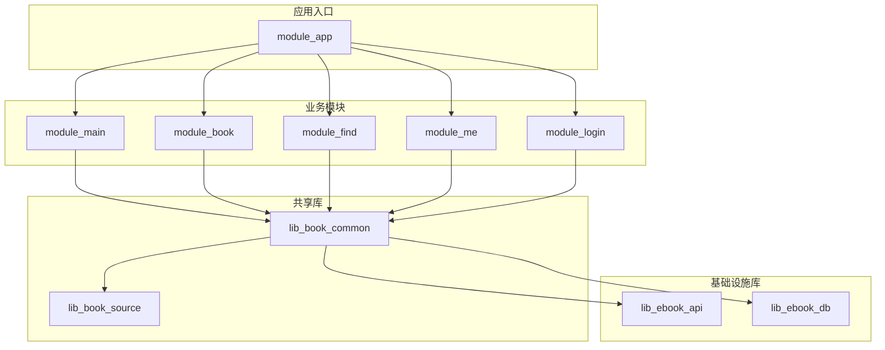
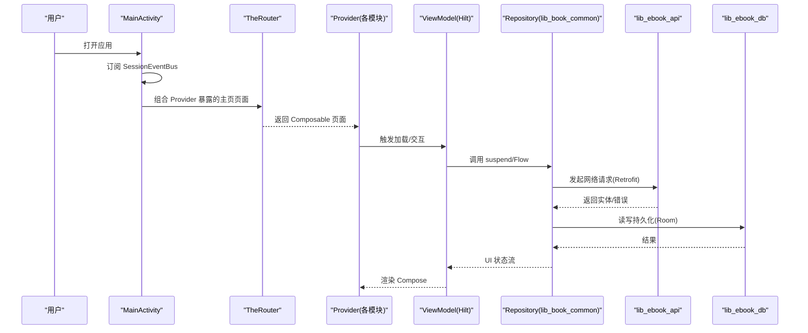
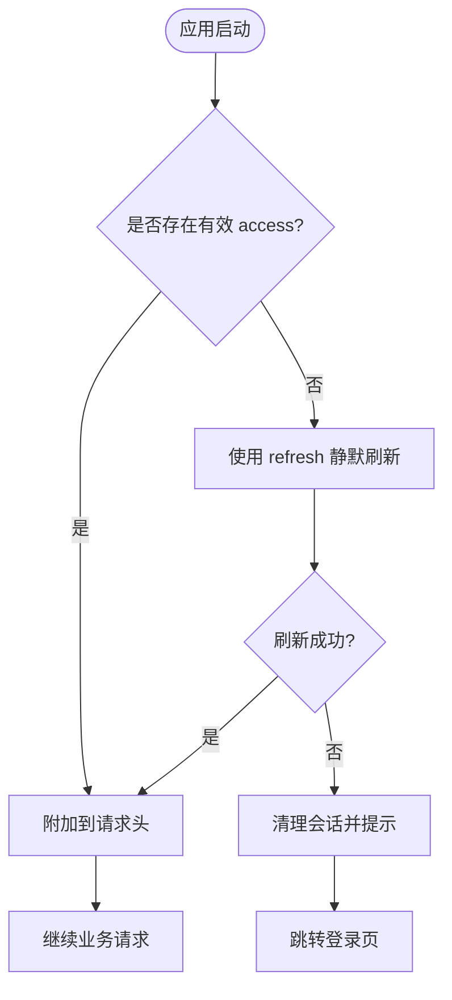
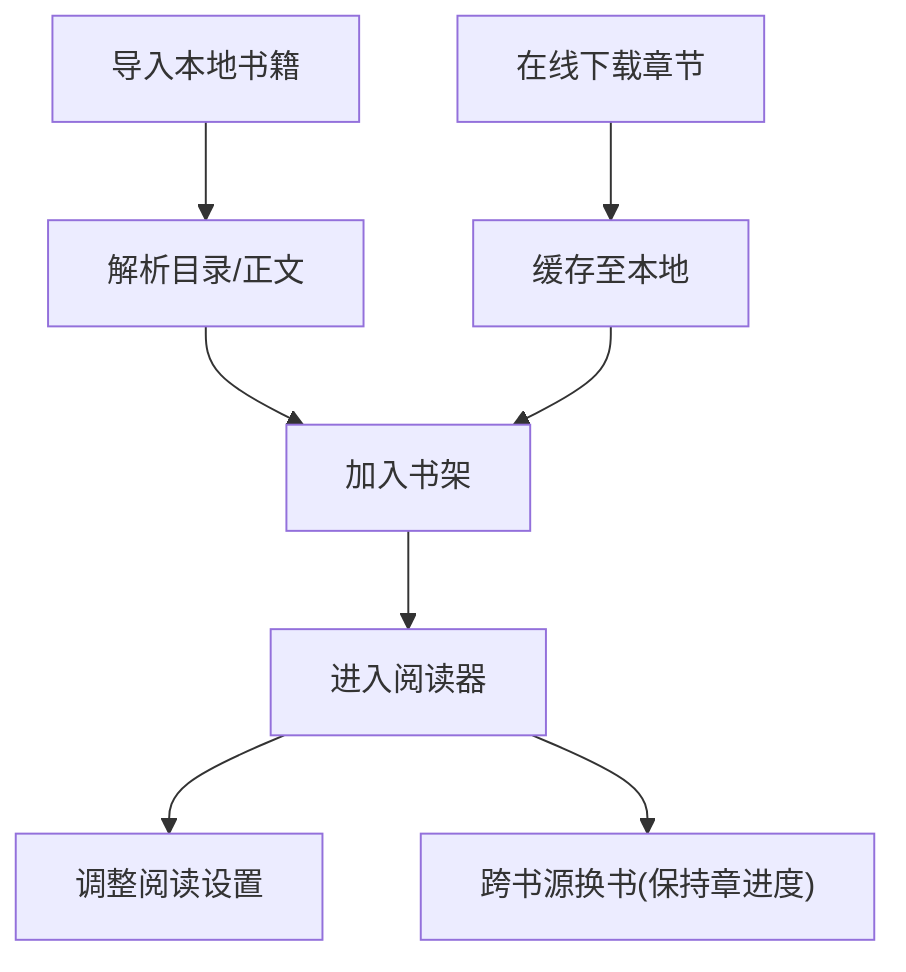
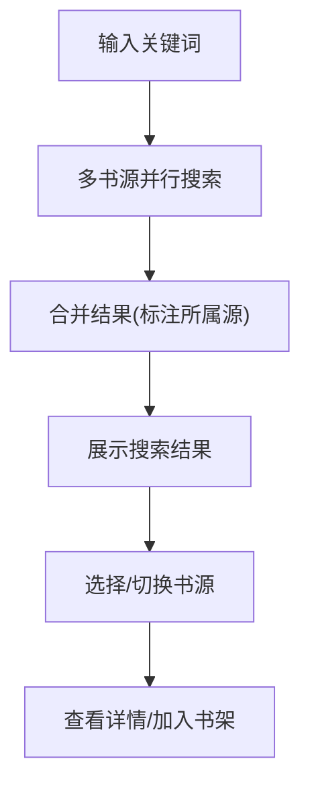
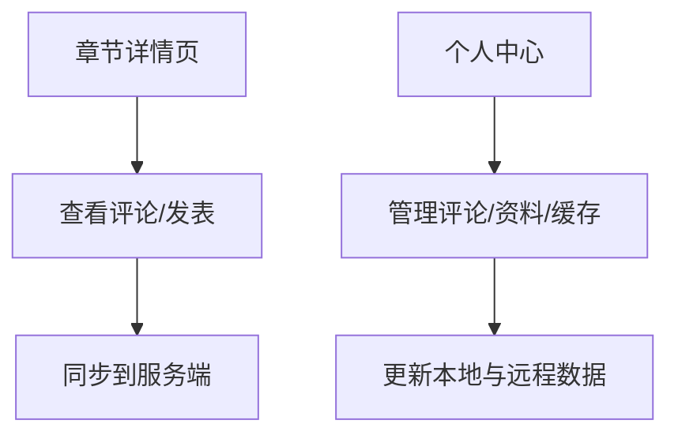
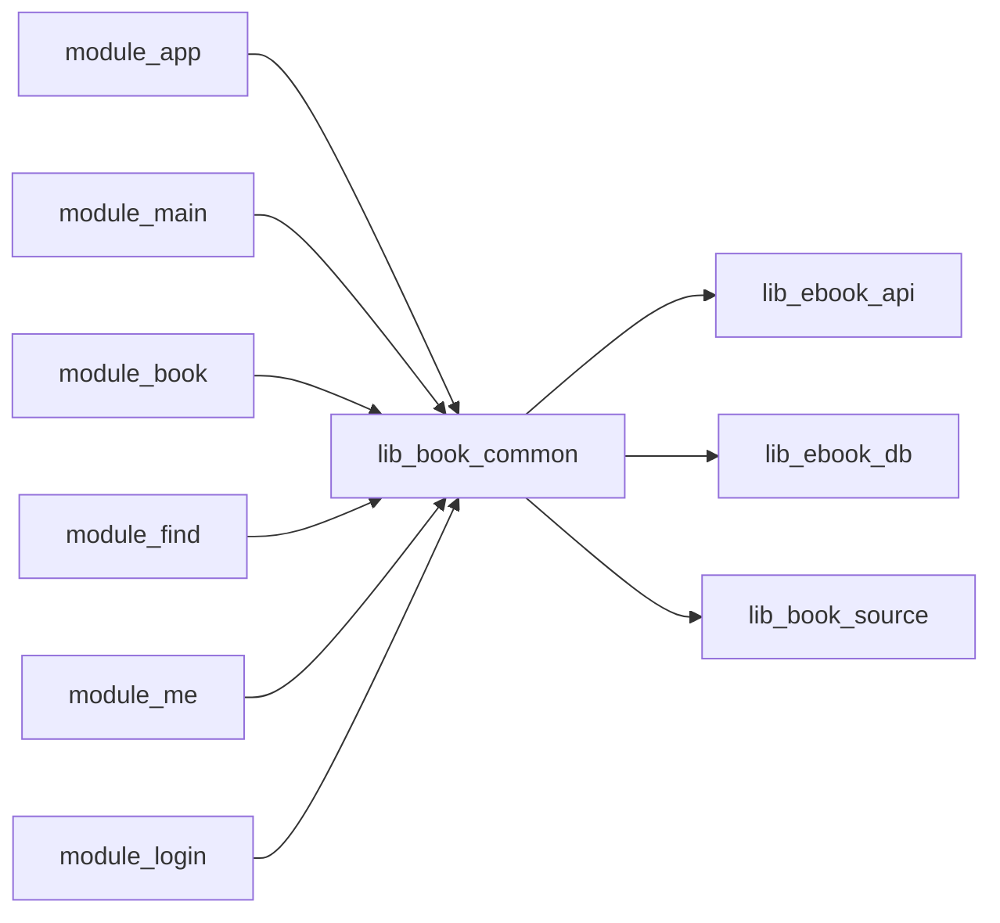

# 项目概述

<cite>
**本文引用的文件**
- [README.MD](file://README.MD)
- [settings.gradle.kts](file://settings.gradle.kts)
- [gradle/libs.versions.toml](file://gradle/libs.versions.toml)
- [module_app/build.gradle.kts](file://module_app/build.gradle.kts)
- [MyApplication.kt](file://module_app/src/main/java/com/ebook/MyApplication.kt)
- [MainActivity.kt](file://module_main/src/main/java/com/ebook/main/MainActivity.kt)
</cite>

## 目录
1. [简介](#简介)
2. [项目结构](#项目结构)
3. [核心组件](#核心组件)
4. [架构总览](#架构总览)
5. [详细组件分析](#详细组件分析)
6. [依赖关系分析](#依赖关系分析)
7. [性能与构建特性](#性能与构建特性)
8. [快速开始指南](#快速开始指南)
9. [故障排查](#故障排查)
10. [结论](#结论)

## 简介
这是一个 100% Kotlin 开发的 Android 小说阅读器，采用 MVVM + 多模块 Gradle 工程，界面已全面迁移到 Jetpack Compose（含阅读器）。项目提供账号体系、书架与阅读、书城与搜索、章节评论、个人中心等核心功能；通过 JSON 规则驱动的多书源机制支持跨站聚合搜索与下载；同时提供 mock/real 双构建模式，无需后端即可完整开发调试。

- 目标与价值
  - 为读者提供稳定流畅的阅读体验（本地导入与在线下载、离线缓存、主题与排版设置）
  - 为开发者提供高内聚、低耦合的模块化架构与可插拔书源解析能力
  - 以现代化技术栈提升可维护性与可测试性（Compose、Hilt、Coroutines、Room、Retrofit）

- 关键特性概览
  - 账号体系：邮箱为主标识，三步注册、双 token 静默续期、密码不落盘
  - 书架与阅读：本地 txt 导入与在线下载、章节缓存、阅读设置、跨书源换书、前台下载服务
  - 书城与搜索：JSON 规则驱动、多书源共存、跨源聚合搜索、分类浏览、搜索历史快捷操作
  - 章节评论：按章浏览与发表评论、个人中心管理
  - 个人中心：阅读概览、缓存管理、头像昵称修改、版本更新检查与设置

**章节来源**
- [README.MD:10-28](file://README.MD#L10-L28)
- [README.MD:119-176](file://README.MD#L119-L176)

## 项目结构
项目采用业务模块与基础库分离的多模块架构，依赖方向自顶向下：业务模块 → lib_book_common → lib_ebook_api / lib_ebook_db；lib_book_source 提供书源解析专用层（原生解析器 + 脚本解释器 + :js 沙箱）。

**图表来源**
- [settings.gradle.kts:55-65](file://settings.gradle.kts#L55-L65)

**章节来源**
- [settings.gradle.kts:55-65](file://settings.gradle.kts#L55-L65)
- [README.MD:86-103](file://README.MD#L86-L103)

## 核心组件
- 应用入口与初始化
  - MyApplication：装配 Hilt、注册路由登录拦截、启动内容仓库对账（延迟通过 EntryPoint 获取 BookRepository），并隔离沙箱进程
- 主页导航容器
  - MainActivity：Compose 三 Tab 宿主，订阅会话过期事件统一处理（清会话、提示、跳转登录），并通过 TheRouter 组合各模块 Provider 暴露的主页页面
- 构建与产物
  - module_app 定义 real/mock 双 flavor，集成态组装所有业务模块；独立模块开发可通过 isModule=true 使功能模块作为独立 App 运行

**章节来源**
- [MyApplication.kt:19-66](file://module_app/src/main/java/com/ebook/MyApplication.kt#L19-L66)
- [MainActivity.kt:45-115](file://module_main/src/main/java/com/ebook/main/MainActivity.kt#L45-L115)
- [module_app/build.gradle.kts:17-26](file://module_app/build.gradle.kts#L17-L26)

## 架构总览
项目遵循 MVVM + Hilt + Coroutines/Flow，UI 全部使用 Jetpack Compose；网络与数据层分别由 Retrofit+OkHttp 与 Room 提供；跨模块通信使用 TheRouter + Provider 接口；书源解析由 lib_book_source 提供原生与脚本两种实现，并通过沙箱执行 JS 规则。

**图表来源**
- [MainActivity.kt:68-79](file://module_main/src/main/java/com/ebook/main/MainActivity.kt#L68-L79)
- [MainActivity.kt:184-195](file://module_main/src/main/java/com/ebook/main/MainActivity.kt#L184-L195)

**章节来源**
- [README.MD:105-117](file://README.MD#L105-L117)
- [README.MD:150-161](file://README.MD#L150-L161)

## 详细组件分析

### 账号体系与会话管理
- 邮箱为主标识，注册三步走（发码→建号→登录）
- 双 token（access 短时效 + refresh 长时效）静默续期，密码不落盘
- 会话过期由网络层收口，统一清理并跳转登录

**图表来源**
- [README.MD:131-137](file://README.MD#L131-L137)
- [README.MD:150-161](file://README.MD#L150-L161)

**章节来源**
- [README.MD:17-23](file://README.MD#L17-L23)
- [README.MD:131-137](file://README.MD#L131-L137)

### 书架与阅读
- 本地 txt 导入与在线下载，章节缓存离线阅读
- 阅读界面设置（背景主题/字号等），跨书源换书且进度按章序号迁移
- 下载为前台服务，兼容 Android 14+

**图表来源**
- [README.MD:19-23](file://README.MD#L19-L23)

**章节来源**
- [README.MD:19-23](file://README.MD#L19-L23)

### 书城与搜索
- 书源由 JSON 规则驱动，优先改规则而非硬编码
- 多书源共存，内置源随应用出货，用户源可导入导出
- 跨源聚合搜索，单源失败不影响其余；书城顶部切换浏览源
- 搜索历史支持快捷点选与一键清除

**图表来源**
- [README.MD:21-23](file://README.MD#L21-L23)

**章节来源**
- [README.MD:21-23](file://README.MD#L21-L23)

### 章节评论与个人中心
- 章节评论：按章浏览与发表评论，个人中心管理（长按删除）
- 个人中心：阅读概览、缓存管理、昵称/头像修改、设置与关于

**图表来源**
- [README.MD:23-25](file://README.MD#L23-L25)

**章节来源**
- [README.MD:23-25](file://README.MD#L23-L25)

## 依赖关系分析
- 模块依赖方向严格：业务模块 → lib_book_common → lib_ebook_api / lib_ebook_db；lib_book_source 为书源解析专用层
- 跨模块通过 TheRouter + Provider 解耦；Hilt 负责依赖注入
- 版本管理集中在 gradle/libs.versions.toml

**图表来源**
- [settings.gradle.kts:55-65](file://settings.gradle.kts#L55-L65)

**章节来源**
- [settings.gradle.kts:55-65](file://settings.gradle.kts#L55-L65)
- [gradle/libs.versions.toml:1-237](file://gradle/libs.versions.toml#L1-L237)

## 性能与构建特性
- 构建系统：Gradle 9.4.1 + AGP 9.2.1（内置 Kotlin）、KSP、版本目录统一管理依赖
- 运行时优化：前台下载服务、离线缓存、Composable 状态最小化、Coil 图片加载
- 混淆与发布：release 开启 R8，consumer-rules 集中管理；独立模块可独立运行便于调试

**章节来源**
- [README.MD:105-117](file://README.MD#L105-L117)
- [README.MD:149-161](file://README.MD#L149-L161)
- [module_app/build.gradle.kts:27-36](file://module_app/build.gradle.kts#L27-L36)

## 快速开始指南
- 环境要求
  - Android Studio >= 2025.1.3
  - JDK 17（Android Studio 自带 JBR 即可）
  - Gradle 9.4.1 / AGP 9.2.1（wrapper 自带）
  - 目标设备：compileSdk/targetSdk 37、minSdk 26（Android 8.0+）

- 构建与运行
  - 克隆项目后，mock 构建（推荐先跑这个）：./gradlew :module_app:assembleMockDebug
  - real 构建（连接真实后端）：./gradlew :module_app:assembleRealDebug
  - Windows PowerShell 下用 .\gradlew 替代 ./gradlew

- 后端基址配置
  - 经 local.properties 的 ebook.server.host 注入（缺省 10.0.2.2，即模拟器访问宿主机）
  - 局域网真机调试时改成宿主机 IP

- 独立模块开发
  - gradle.properties 中 isModule=true 时，各功能模块可作为独立 App 运行（自带 mock 数据源）

**章节来源**
- [README.MD:51-84](file://README.MD#L51-L84)

## 故障排查
- 常见问题定位
  - 页面不闪退但数据永远加载不出来：检查 mock 资产契约是否与 DTO 形态一致；检查权限与网络拦截器配置
  - 会话过期未正确处理：确认网络层是否统一收口 A0230 过期事件；确认页面是否通过 reportFailure 上报
  - 独立模块路由丢失：TheRouter 在独立模式下找不到路由只记日志，需在 src/main/test/debug/ 宿主挂占位路由
  - 沙箱执行失败：区分“未装配执行器”与“执行失败”，避免将两者混同为“源失效”

- 调试建议
  - 使用 mock 构建快速验证 UI 与流程
  - 通过 adb reverse + local.properties 配置本机后端地址
  - 关注日志输出（统一 Logger 工具类）

**章节来源**
- [README.MD:78-84](file://README.MD#L78-L84)
- [README.MD:139-147](file://README.MD#L139-L147)

## 结论
本项目以现代化技术栈与清晰的模块化架构，提供了完整的小说阅读体验与可扩展的书源解析能力。通过 mock/real 双构建模式、统一的依赖管理与严格的架构约定，既适合初学者入门学习，也为有经验的开发者提供了深入定制与扩展的基础。建议贡献者遵循提交规范与 ADR 决策记录，保持代码、注释与文档的一致性。