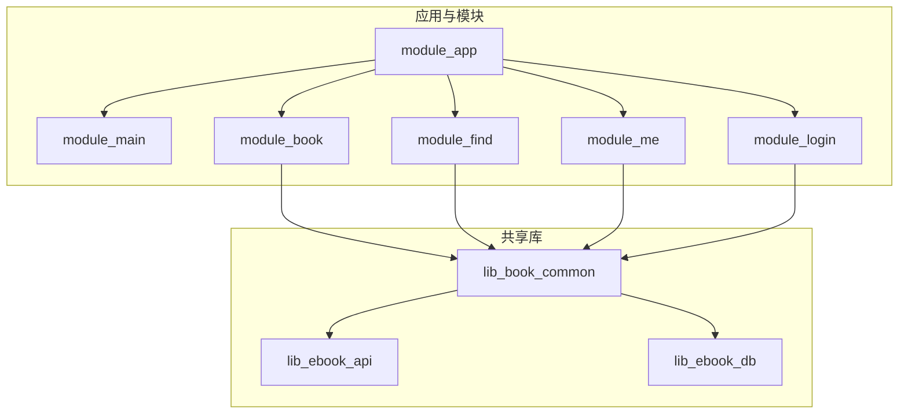
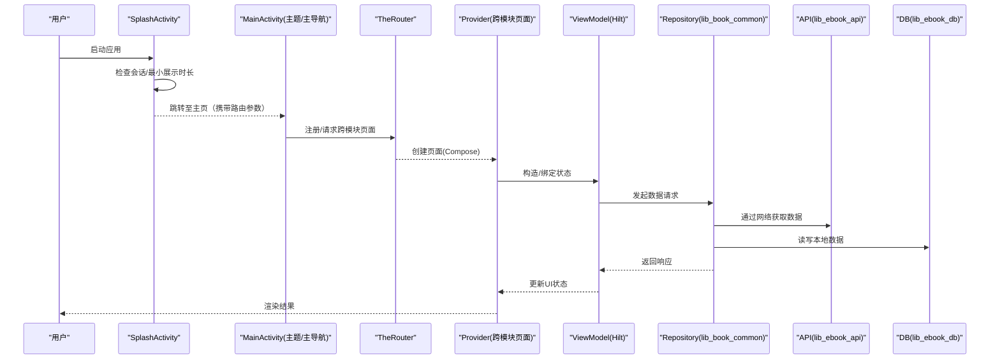
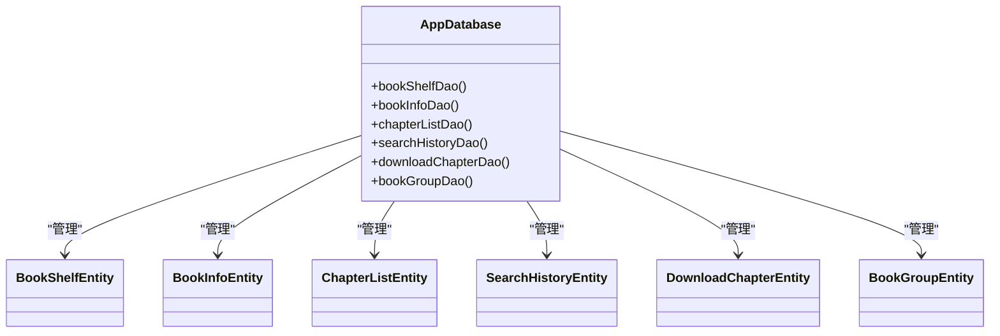
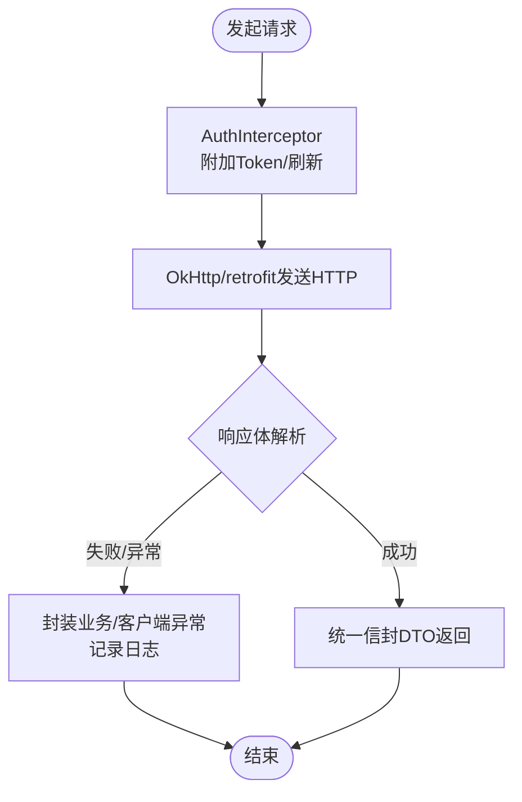
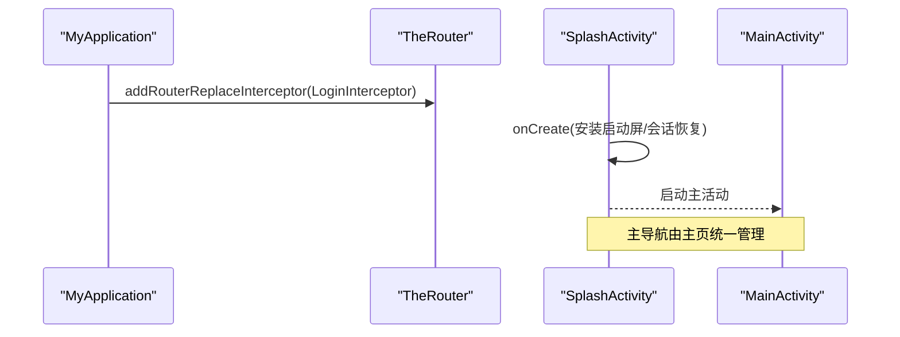
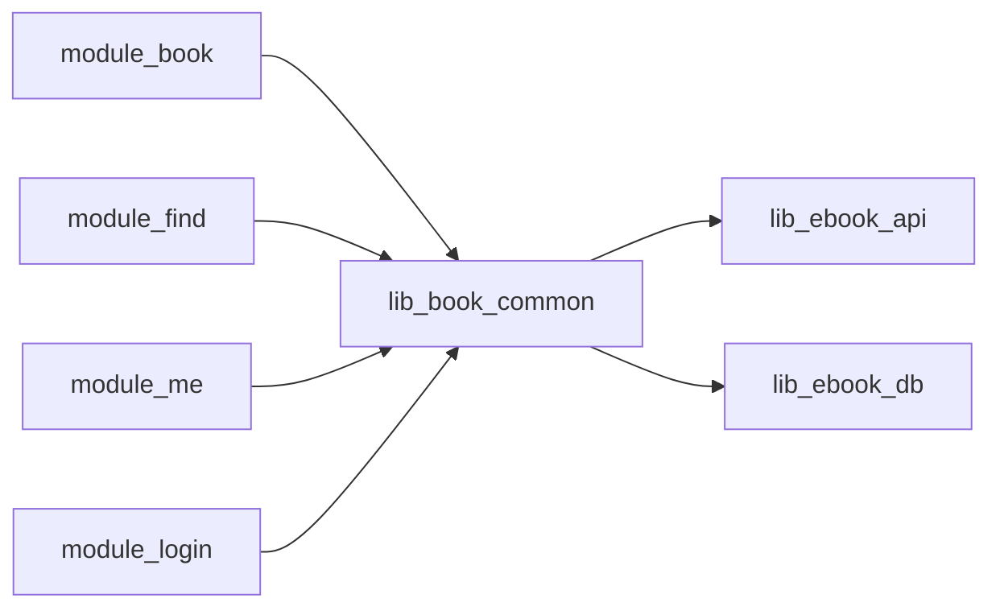

# 项目概述

<cite>
**本文引用的文件**   
- [settings.gradle.kts](file://settings.gradle.kts)
- [gradle/libs.versions.toml](file://gradle/libs.versions.toml)
- [module_app/build.gradle.kts](file://module_app/build.gradle.kts)
- [lib_book_common/build.gradle.kts](file://lib_book_common/build.gradle.kts)
- [lib_ebook_api/build.gradle.kts](file://lib_ebook_api/build.gradle.kts)
- [lib_ebook_db/build.gradle.kts](file://lib_ebook_db/build.gradle.kts)
- [README.md](file://README.md)
- [AGENTS.md](file://AGENTS.md)
- [module_app/src/main/java/com/ebook/MyApplication.kt](file://module_app/src/main/java/com/ebook/MyApplication.kt)
- [module_main/src/main/java/com/ebook/main/SplashActivity.kt](file://module_main/src/main/java/com/ebook/main/SplashActivity.kt)
- [lib_ebook_db/src/main/java/com/ebook/db/AppDatabase.kt](file://lib_ebook_db/src/main/java/com/ebook/db/AppDatabase.kt)
- [docs/adr/0001-compose-migration-endstate.md](file://docs/adr/0001-compose-migration-endstate.md)
</cite>

## 目录
1. [介绍](#介绍)
2. [项目结构](#项目结构)
3. [核心组件](#核心组件)
4. [架构总览](#架构总览)
5. [关键组件详解](#关键组件详解)
6. [依赖分析](#依赖分析)
7. [性能与可扩展性考虑](#性能与可扩展性考虑)
8. [故障排查指南](#故障排查指南)
9. [结论](#结论)
10. [附录：快速开始与版本管理](#附录快速开始与版本管理)

## 介绍
本项目是一个 100% Kotlin 开发的 Android 小说阅读器，采用 MVVM 多模块 Gradle 架构，界面全面迁移到 Jetpack Compose（含阅读器）。项目提供书架管理、书籍搜索、在线书源解析下载、章节阅读与离线缓存、个人中心等功能。项目通过模块化清晰分离业务域，通过共享库沉淀跨模块能力；以 Hilt 进行依赖注入、Retrofit+OkHttp 为网络层、Room 作为本地数据层、Kotlin 协程与 Flow 处理异步流程，并配合严格的构建约定、版本目录和持续集成实践，确保可维护性与一致性。

## 项目结构
仓库由一个应用壳 module_app 与多个功能模块、共享库组成：
- 模块（按职责拆分，互不直接依赖）
  - module_app：应用入口与装配层（real/mock 双 flavor）
  - module_main：主页、启动页与路由组装
  - module_book：书架、阅读、评论、导入等阅读相关能力
  - module_find：书城、搜索、分类浏览
  - module_me：个人中心、头像、缓存、设置与关于
  - module_login：登录、注册、密码相关流程
- 共享库（分层递进，越靠下越基础）
  - lib_book_common：ebook 领域共享 UI 组件、Provider 接口、通用解析工具、会话与 Repository 封装
  - lib_ebook_api：网络层（Retrofit、拦截器、数据模型、协议适配）
  - lib_ebook_db：Room 实体与 DAO 定义及迁移链

**图表来源**
- [settings.gradle.kts:46-64](file://settings.gradle.kts#L46-L64)
- [README.md:86-103](file://README.md#L86-L103)

**节内来源**
- [settings.gradle.kts:46-64](file://settings.gradle.kts#L46-L64)
- [module_app/build.gradle.kts:47-57](file://module_app/build.gradle.kts#L47-L57)

## 核心组件
- 应用外壳与初始化
  - MyApplication 通过 Hilt 管理应用级生命周期，并接入 TheRouter 的登录拦截器完成鉴权前置控制
  - 启动流程由 SplashActivity 承担，预加载用户会话并在最小时长后进入主页，保证首帧渲染前会话就绪
- 本地数据层
  - AppDatabase 统一声明六张表与 DAO 暴露点，遵循 Room 迁移约束，集中承载书架、书籍信息、章节目录、搜索历史、下载队列、作品分组等离线可用数据
- 网络与解析
  - lib_ebook_api 基于 Retrofit + OkHttp，封装请求拦截（如认证）、序列化与统一信封契约；书源解析依赖 Jsoup 支持网页抓取
- 页面与交互
  - 所有页面以 Compose 构建，使用 Material Design 3，并通过 TheRouter + Provider 实现跨模块页面组合

**节内来源**
- [module_app/src/main/java/com/ebook/MyApplication.kt:8-14](file://module_app/src/main/java/com/ebook/MyApplication.kt#L8-L14)
- [module_main/src/main/java/com/ebook/main/SplashActivity.kt:54-137](file://module_main/src/main/java/com/ebook/main/SplashActivity.kt#L54-L137)
- [lib_ebook_db/src/main/java/com/ebook/db/AppDatabase.kt:8-63](file://lib_ebook_db/src/main/java/com/ebook/db/AppDatabase.kt#L8-L63)
- [lib_book_common/build.gradle.kts:34-89](file://lib_book_common/build.gradle.kts#L34-L89)
- [lib_ebook_api/build.gradle.kts:48-72](file://lib_ebook_api/build.gradle.kts#L48-L72)

## 架构总览
项目采用“业务模块 → 共享库 → 基础库”的单向依赖方向，结合 MVVM + Hilt 注入，以及 Compose 视图层，形成清晰的职责边界。

**图表来源**
- [module_main/src/main/java/com/ebook/main/SplashActivity.kt:97-116](file://module_main/src/main/java/com/ebook/main/SplashActivity.kt#L97-L116)
- [lib_ebook_api/build.gradle.kts:48-72](file://lib_ebook_api/build.gradle.kts#L48-L72)
- [lib_book_common/build.gradle.kts:34-89](file://lib_book_common/build.gradle.kts#L34-L89)

## 关键组件详解

### 数据层与持久化（Room）
- 数据库中心：AppDatabase 集中管理实体与 DAO，version 严格递增，迁移链不得跳版，禁止破坏性回退
- 主键策略：自然键（note_url 等）稳定定位资源；流水型数据（下载任务、搜索历史）用自增 ID，去重在上层仓库中完成
- 数据范围：书架、书籍详情、章节目录、搜索历史、下载队列、作品分组；正文内容与封面已迁移至 BookStore 章文件，不再落库

**图表来源**
- [lib_ebook_db/src/main/java/com/ebook/db/AppDatabase.kt:34-63](file://lib_ebook_db/src/main/java/com/ebook/db/AppDatabase.kt#L34-L63)

**节内来源**
- [lib_ebook_db/src/main/java/com/ebook/db/AppDatabase.kt:8-63](file://lib_ebook_db/src/main/java/com/ebook/db/AppDatabase.kt#L8-L63)

### 网络层与服务（Retrofit + OkHttp）
- lib_ebook_api 统一网络栈：Retrofit + Kotlinx Serialization + OkHttp 日志，配合拦截器处理认证与会话刷新
- 构建期服务端地址从 local.properties 注入（缺省模拟器访问宿主机），避免硬编码；真实/模拟环境通过 product flavor 切换

**图表来源**
- [lib_ebook_api/build.gradle.kts:48-72](file://lib_ebook_api/build.gradle.kts#L48-L72)

**节内来源**
- [lib_ebook_api/build.gradle.kts:12-24](file://lib_ebook_api/build.gradle.kts#L12-L24)
- [AGENTS.md:认证体系约定](file://AGENTS.md#认证体系约定)

### 模块装配与启动流程
- module_app 定义 network dimension 的 real/mock flavor，聚合各功能模块
- MyApplication 注入 Hilt 并开始路由器拦截链
- SplashActivity 负责会话预载与最短展示时间门控，然后跳转 MainActivity 完成主导航

**图表来源**
- [module_app/src/main/java/com/ebook/MyApplication.kt:8-14](file://module_app/src/main/java/com/ebook/MyApplication.kt#L8-L14)
- [module_main/src/main/java/com/ebook/main/SplashActivity.kt:97-116](file://module_main/src/main/java/com/ebook/main/SplashActivity.kt#L97-L116)

**节内来源**
- [module_app/build.gradle.kts:17-26](file://module_app/build.gradle.kts#L17-L26)
- [module_app/build.gradle.kts:47-57](file://module_app/build.gradle.kts#L47-L57)

### 阅读界面与技术栈（Compose）
- 全仓页面（含阅读器）迁移至 Compose，保留 Material Design 3 语义色与系统深色模式适配；阅读界面整片豁免系统深色
- ADR 明确迁移终态与豁免边界，统一视觉基线与交互体验

**节内来源**
- [docs/adr/0001-compose-migration-endstate.md:1-13](file://docs/adr/0001-compose-migration-endstate.md#L1-L13)

## 依赖分析
- 模块间依赖方向严格为：业务模块 → lib_book_common → (lib_ebook_api | lib_ebook_db)
- 通过 TheRouter + Provider 进行跨模块页面组合，避免模块间直接耦合
- 版本集中管理于 gradle/libs.versions.toml，所有模块以 alias 引用，降低版本漂移风险

**图表来源**
- [settings.gradle.kts:56-64](file://settings.gradle.kts#L56-L64)
- [README.md:86-103](file://README.md#L86-L103)

**节内来源**
- [gradle/libs.versions.toml:1-70](file://gradle/libs.versions.toml#L1-L70)
- [AGENTS.md:模块架构](file://AGENTS.md#模块架构)

## 性能与可扩展性考虑
- 网络性能：OkHttp 连接复用、统一拦截器减少重复逻辑；Retrofit + 序列化解耦协议细节
- 数据库性能：Room + 事务操作，按用途分 DAO；避免在主线程执行耗时 I/O
- UI 性能：Compose 按需重组、稳定的 item key、列表分页与合并去重保障流畅滚动
- 扩展性：多书源规划（ADR 0016）、Provider 接口隔离跨模块、product flavor 支撑 mock/real 双环境并行开发

[无具体文件引用]

## 故障排查指南
- 启动卡死或二次跳转：检查 SplashActivity 的门控任务与持久化标志是否命中，确认超时与跳过逻辑正确释放资源
- 网络始终无法加载：核对 local.properties 的 ebook.server.host，确认模拟器回环或局域网端口映射（adb reverse）；检查拦截器是否误带 token 导致第三方书源拒绝
- 数据库错误：查看迁移版本是否正确递增，是否遗漏新 schema JSON；避免启用破坏性迁移
- 跨模块路由不生效：独立模式下需确保占位路由存在，修改 @Route 后需二次构建刷新路由表
- 权限问题：targetSdk 调整时重新评估清单权限，特别是前台服务类型（dataSync）和网络访问限制

**节内来源**
- [module_main/src/main/java/com/ebook/main/SplashActivity.kt:97-169](file://module_main/src/main/java/com/ebook/main/SplashActivity.kt#L97-L169)
- [lib_ebook_db/src/main/java/com/ebook/db/AppDatabase.kt:21-32](file://lib_ebook_db/src/main/java/com/ebook/db/AppDatabase.kt#L21-L32)
- [AGENTS.md:提交前验证/前台服务约定/权限改动建议](file://AGENTS.md#提交前验证)

## 结论
本项目以现代化 Android 技术栈为基础，通过明确的模块化划分、MVVM 分层、统一依赖注入与构建配置，实现了高内聚低耦合的可维护架构。全面的 Compose 迁移确保了 UI 体验的一致性与演进空间；Room 与 Retrofit 提供了稳健的数据网络基座。凭借 flavor 机制与 mock 数据源，团队可在无后端环境下高效协作与迭代。对于初学者，可从 module_app 与 module_main 切入理解入口与导航；对于资深开发者，应重点关注共享库边界的稳定性与向后兼容性，以及数据/网络协议的演进策略。

[无具体文件引用]

## 附录：快速开始与版本管理
- 环境要求：Android Studio >= 指定版本、JDK 17、目标 SDK 37、minSdk 26
- 构建命令：分别使用 mock/real flavor 进行调试与联调；独立模块模式用于单模块开发
- 版本管理：全局集中在 gradle/libs.versions.toml，模块依赖通过 alias 引用
- 构建脚本：build-logic 提供自定义约定插件，统一 Android/Kotlin/Room/Hilt/Compose 配置

**节内来源**
- [README.md:49-84](file://README.md#L49-L84)
- [gradle/libs.versions.toml:1-70](file://gradle/libs.versions.toml#L1-L70)
- [AGENTS.md:技术栈与构建约定](file://AGENTS.md#技术栈与构建约定)