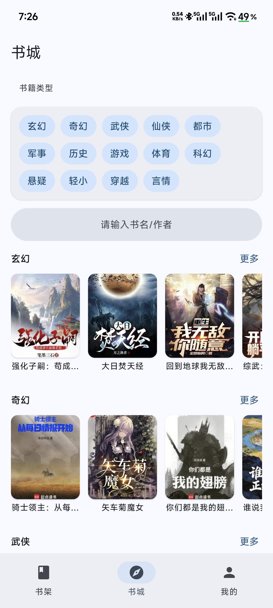

# 安卓小说阅读器

<p>
  
  
  
  
</p>

一个 100% Kotlin 开发的安卓小说阅读器，MVVM + 多模块架构，界面已全部迁移到 Jetpack Compose（含阅读器）。
最初是我本科毕业设计（2020 届），此后更新就没彻底停下——纯粹兴趣使然，维护节奏比较随缘，但一定会慢慢改、慢慢优化。

功能持续优化中，欢迎 Star、交流与提建议。

## 功能特性

- **账号体系**：邮箱为登录主标识，三步注册（发码 → 建号 → 登录）、双 token 会话静默续期、密码不落盘；忘记密码走邮箱验证码，已登录可凭旧密码直接改密

- **书架与阅读**：本地 txt 导入与书源在线下载，章节缓存离线阅读，阅读界面设置（背景主题/字号等），下载为前台服务（兼容 Android 14+）

- **书城与搜索**：书源由 **JSON 规则**驱动，适配新网站优先改 JSON 规则（当前单书源，多书源管理为规划项）；支持关键词/作者搜索与分类浏览，搜索历史支持快捷点选与一键清除（粒子爆炸动效）

- **章节评论**：按章浏览与发表评论，个人中心可管理（长按删除）自己的评论

- **个人中心**：阅读概览、缓存管理、昵称/头像修改（拍照/相册 + 圆形裁剪）、设置与关于（用户协议/隐私政策/开源许可）

> 搜索书籍？书源说的算！书籍分类？书源说的算！

## 应用截图

<div style="display: flex; justify-content: center;">
  <figure style="text-align: center; margin-right: 20px;">
    
  </figure>
  <figure style="text-align: center; margin-right: 20px;">
    
  </figure>
  <figure style="text-align: center; margin-right: 20px;">
    
  </figure>
  <figure style="text-align: center; margin-right: 20px;">
    
  </figure>
  <figure style="text-align: center;">
    
  </figure>
</div>

## 快速开始

### 环境要求

| 项              | 要求                                              |
| -------------- | ----------------------------------------------- |
| Android Studio | >= 2025.1.3（低版本不支持当前 Gradle）                    |
| JDK            | 17（Android Studio 自带 JBR 即可）                    |
| Gradle / AGP   | 9.4.1 / 9.2.1（wrapper 自带，无需本地安装）                |
| 目标设备           | compileSdk/targetSdk 37、minSdk 26（Android 8.0+） |

### 构建运行

项目提供 **real / mock 双构建**，无需后端服务器也能完整开发调试：

```bash
# 克隆项目
git clone git@github.com:xrn1997/android-ebook.git

# mock 构建：内存数据源，开箱即用（推荐先跑这个）
./gradlew :module_app:assembleMockDebug

# real 构建：连接真实后端，需先本地启动
# ebook-server（Go）：https://github.com/xrn1997/ebook-server
./gradlew :module_app:assembleRealDebug
```

> **Windows PowerShell** 下用 `.\gradlew` 替代 `./gradlew`。

补充说明：

- **后端基址**：经 `local.properties` 的 `ebook.server.host` 注入（缺省 `10.0.2.2`，即模拟器访问宿主机）。局域网真机调试时改成宿主机 IP

- **lib\_common 联动**：基础库 `lib_common` 仍在迭代，根 `settings.gradle.kts`的`includeBuild`当前启用，经`lib-common-build/`迷你独立构建以**相对路径**引用源码（两边可同步改）。lib\_common 稳定后注释掉 `includeBuild` 即改回 Maven 依赖（`io.github.xrn1997:common`）

- **独立模块开发**：`gradle.properties` 中 `isModule=true` 时，各功能模块可作为独立 App 运行（自带 mock 数据源，免后端），便于单模块开发调试

## 项目结构

依赖方向：**业务模块 → lib\_book\_common → lib\_ebook\_api → lib\_ebook\_db**（功能模块互不依赖，跨模块走 TheRouter + Provider 接口）。

```
module_app        → 应用入口，组装所有功能模块（real/mock 双 flavor）
module_main       → 主页、启动页
module_book       → 书籍阅读、管理、评论
module_find       → 书城、搜索、书库浏览
module_me         → 个人中心、头像、评论管理
module_login      → 登录/注册/密码
lib_book_common   → ebook 域共享 UI 组件、Provider 接口、书源解析（通用工具类/基类归 lib_common）
lib_ebook_api     → 网络层：Retrofit 服务、数据实体、OkHttp 拦截器
lib_ebook_db      → Room 数据库实体与 DAO
lib-common-build/ → lib_common 迷你独立构建（临时联动方案）
build-logic/      → 自定义 Gradle 约定插件（统一构建配置）
docs/adr/         → 架构决策记录（ADR）
```

## 技术栈

> 完整版本以 [`gradle/libs.versions.toml`](gradle/libs.versions.toml) 为准。

- **语言与构建**：Kotlin 2.4.10、Gradle 9.4.1 + AGP 9.2.1（内置 Kotlin）、KSP、版本目录

- **UI**：Jetpack Compose（全部页面，含阅读器），Material Design 3

- **架构**：MVVM（Model → ViewModel → View），Hilt 依赖注入，Coroutines + Flow（RxJava 已全部移除）

- **网络与数据**：Retrofit + OkHttp、Room、Jsoup（书源解析）、Coil（图片）

- **跨模块**：TheRouter 路由 + Provider 接口

## 近期重大更新

**界面全面 Compose 化**

- 全部页面已完成迁移（含阅读器：翻页状态机、章节目录、亮度/字体/设置面板均为 Compose），ViewBinding 与 XML 布局已移除（迁移终态见 ADR-0001）

- 认证域四页（登录/注册/验证身份/改密）统一为标准 M3 表单风格，发码按钮带 60 秒倒计时（与服务端频控对齐）

- 书城/搜索页按共享设计语言重设计：胶囊分类标签、圆形揭示、空输入抖动、清除历史的粒子爆炸等动效用 Compose 重制保留（见 ADR-0006）

- 跨模块共享组件收敛到 `lib_book_common`（卡片/列表项/标签/封面统一设计语言，见 ADR-0006）

**认证体系现代化**

- 账号模型对齐：邮箱为登录主标识（用户名仅展示用），三步注册、改密双路径（已登录旧密码 / 忘记密码邮箱验证码）（见 ADR-0009）

- 双 token（access 2h + refresh 30d）会话：密码不落盘、access 只驻内存、启动恢复经 refresh token 静默续期、A0230 过期单飞静默刷新、会话过期统一收口（见 ADR-0008/0010/0011）

- API 契约对齐：HTTP 恒 200 + `RespDTO` 信封 + 五位业务码，传输/业务/客户端异常三层分治（见 ADR-0007）

**后端与离线开发**

- [ebook-server](https://github.com/xrn1997/ebook-server)（Go）重写替代 2022 年过期的旧服务器，提供注册/登录/刷新/改密/忘记密码/评论等能力，基址经 `local.properties` 注入不硬编码

- mock 数据源机制：`real`/`mock` 双 flavor + 独立模块自动切换，无后端也能完整开发调试

- 我的页新增阅读概览、缓存管理、设置/关于体系（用户协议/隐私政策/开源许可）

- 搜索历史语义收敛：全量展示 + 点选快捷搜索 + 一键清除，不做子串过滤（见 ADR-0005）

**架构与工程化**

- Java → Kotlin 100% 迁移；Dagger → Hilt（全项目 `@HiltViewModel` + `@Inject`）

- 删除 MVP 统一 MVVM，移除 DataBinding 与 ViewBinding，界面全部迁移至 Compose

- TheRouter 替换 ARouter（停止维护）（希望开源库作者人没事 🙏）

- RxJava3 → Coroutines 迁移完成：全项目移除 Rx 依赖与引用，异步统一 suspend + Flow

- 增加 build-logic 约定插件（支持 KTS 模块 lib/app 互转）；common 模块（lib\_common）已上传 Maven 中央仓库（迭代期经迷你独立构建联动，如需源码请联系我）

- KSP 全面替代 KAPT；Gradle 升级至 **9.4.1**，Kotlin 升级至 **2.4.10**，AGP **9.2.1**（内置 Kotlin），目标设备 API 37

**UI 与功能**

- 重构头像裁剪功能（[CircleImageView](https://github.com/hdodenhof/CircleImageView)，停止维护），图片选择从真实路径改为全程使用 URI；移除 [AndroidUtilCode](https://github.com/Blankj/AndroidUtilCode)（停止维护）

- 支持沉浸式状态栏；适配深色模式（阅读界面豁免，使用用户自选的阅读背景主题）

- 下载服务改为前台服务，兼容 Android 14+

**数据与存储**

- [greenDAO](https://github.com/greenrobot/greenDAO) → [ObjectBox](https://objectbox.io/) → [Room](https://developer.android.com/jetpack/androidx/releases/room) 两步迁移完成，自然键 + 自增键并存的 ID 策略，规避 ObjectBox 的 ID 复用问题（见 ADR-0003）

- 事件总线从 RxBus 迁移到 SharedFlow（见 ADR-0004）

## 项目方向

- 持续修复 bug

- 补充本地书籍格式支持

- 继续优化书源机制，从单一书源演变为多书源

- 持续完善后端（ebook-server）能力

- 加一些有趣功能（看心情 😎）

## 参与贡献

欢迎 Issue 与 PR：

- 协作与贡献指南（构建命令、架构约定、提交规范）见 [AGENTS.md](AGENTS.md)

- 重大架构决策以 [docs/adr/](docs/adr/) 的 ADR 为准，术语定义见 [CONTEXT.md](CONTEXT.md)

- 提交遵循 [Conventional Commits](https://www.conventionalcommits.org/)（中文描述，详见 AGENTS.md 提交规范）

- 无后端环境时使用 mock 构建（见 [快速开始](#构建运行)），涉及新接口请同步 mock 实现与 JSON 资产

## 免责声明与许可证

本项目仅用于**学习与个人技术交流**，**不用于任何商业用途，无任何盈利目的**。

基于 [Apache License 2.0](LICENSE) 开源。

## 联系方式

遇到问题请提 Issue，不限格式，但需要能描述清楚问题。无效或乱提交的 Issue 会被直接关闭。
