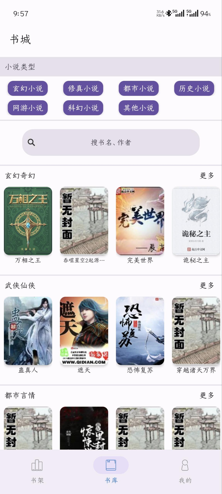

# 安卓小说阅读器

  
  
  
  

## 1 简介

这是一个安卓小说阅读器项目，最初是我本科做毕业设计（2020 届）时写的，但是更新就没彻底停下。多亏各类开源项目的启发与支持，这个应用才能不断完善。

纯粹的兴趣使然，所以维护节奏比较随缘，但一定会慢慢改、慢慢优化。

目前，APP已经升级到 **JDK 17**，并且能够在 Android 15 上运行。

开发参考的开源项目：

- [ZhangQinhao/MONKOVEL](https://github.com/ZhangQinhao/MONKOVEL)（停止维护）
- [mxdldev/android-mvp-mvvm-flytour](https://github.com/mxdldev/android-mvp-mvvm-flytour)（停止维护）

本项目现采用 **MVVM 架构**，功能持续优化中，欢迎交流与提建议。

## 2 功能介绍

### 2.1 用户模块

用于用户身份验证及账号管理，目前唯二的用途是发表章节评论和修改个人信息(名称、头像)

- 用户登录：用户通过账号密码登录应用，获取个人信息和评论数据
- 用户注册：注册新用户账号，仅支持手机号注册
- 忘记密码：用户可通过验证方式找回或重置密码
- 退出登录：用户可主动退出当前登录状态

> 1.验证码仅模拟验证，无实际作用，换句话就是改密码完全不设防，有账户就能改，bug!
>
> 2.用户的状态管理太随便！

### 2.2 评论模块

可以对在线书籍进行每章评论，用户也可以查看和删除自己的评论

- 章节评论：根据章节展示所有用户评论，支持浏览发布、查看章节评论，可以删除用户的个人评论
- 个人评论：用户所有评论均可以在个人信息中查看和删除

> 1.换源就失效，bug!
>
> 2.评论完全没限制，不行！

### 2.3 书籍模块

提供书籍管理和阅读相关功能，书籍来源分为本地导入和书城获取。

- 书籍导入：支持用户本地搜索、导入txt书籍文件
- 内容解析：解析书籍结构，提取章节、内容等信息
- 阅读书籍：提供阅读界面，支持基本的阅读界面设置
- 下载书籍：从书源获取书籍并保存至本地

### 2.4 书城模块

实现在线书籍资源获取功能。

- 书源解析：使用书源的接口获取书籍信息，解析书籍
- 书籍展示：以分类列表的方式展示书源书籍
- 搜索书籍：支持用户按关键词和作者搜索书籍资源

>搜索书籍？书源说的算！书籍分类？书源说的算！
>
>只支持单一书源，太low！

## 3 应用截图

  <figure style="text-align: center; margin-right: 20px;">
    
  </figure>
  <figure style="text-align: center; margin-right: 20px;">
    
  </figure>
  <figure style="text-align: center;">
    
  </figure>
  <figure style="text-align: center;">
    
  </figure>
  <figure style="text-align: center;">
    
  </figure>

## 4 近期重大更新

### 4.1 架构与模块调整

- 基本完成 Java → Kotlin 改造
- 原 common 模块打包为依赖上传至 Maven 中央仓库（如需源码请联系我）
- 增加 build-logic 模块，自定义 Gradle 插件（支持 KTS 模块 lib/app 互转）
- TheRouter 替换 ARouter(停止维护)（希望开源库作者人没事 🙏）
- 删除 MVP，统一 MVVM，移除 DataBinding，支持 View Binding & Compose
- suspend 替换部分 RxJava3 网络请求
- 使用 Hilt 重构依赖注入
- Gradle 升级至 **8.13**，Kotlin 升级至 **2.2.20**，目标设备 API 36
- 使用 KSP 全面替代 KAPT。

> Android Studio < 2025.1.3 不支持 Gradle 8.13，请参考 [IDE 指南](https://developer.android.google.cn/studio/releases?hl=zh-cn)。

### 4.2 UI 及功能优化

- 重构头像裁剪功能([CircleImageView](https://github.com/hdodenhof/CircleImageView))(停止维护)，图片选择从使用文件真实路径改为全程使用 URI
- 移除[AndroidUtilCode](https://github.com/Blankj/AndroidUtilCode)(停止维护)，ToastUtils 有 bug 且依赖 Kotlin 扩展插件与项目冲突
- 登录界面改用 Compose
- 支持沉浸式状态栏
- 适配深色模式

### 4.3 数据与存储

- 使用 [ObjectBox](https://objectbox.io/) 替换 [greenDAO](https://github.com/greenrobot/greenDAO)

  > 效果不如预期，后续可能尝试 Room

### 4.4 服务与后台

- 下载服务改为前台服务，兼容 Android 14+

## 5 项目方向

- 持续修复 bug
- 全面迁移至 Jetpack Compose
- 优化书源机制，向阅读 App 学习（减少维护成本）
- 重写并开源服务端
- 加一些有趣功能（看心情 😎）

## 6 已知问题

1. GreenDAO → ObjectBox 迁移遗留问题
    - 打开书籍会自动写入数据库
    - 删除书籍后再次写入同一对象失败（ObjectBox ID 限制）
2. 不支持解析从 “阅读” App 下载的 txt，自然段解析失效
3. 暂无服务器（旧服务器 2022 年过期）
4. 阅读页未完全适配深色模式，不支持跟随系统切换
5. 从书城直接阅读会导致章节顺序错乱（建议先加入书架）
6. 当前书源 [www.shuangliusc.com](http://www.shuangliusc.com/)搜索失效（非项目问题）
7. 登录模块忘记密码功能存在bug

## 联系方式

遇到问题请提 Issue，不限格式，但需要能描述清楚问题。无效或乱提交的 Issue 会被直接关闭。

